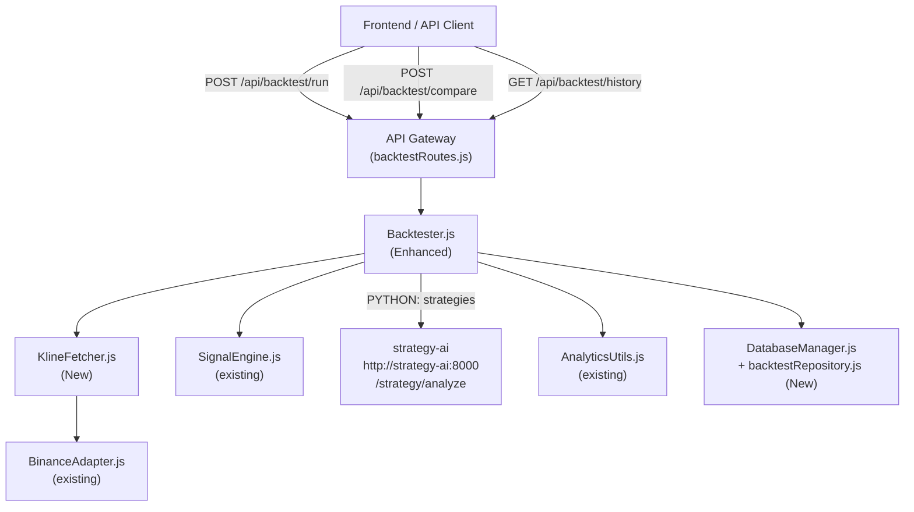

# Design Document: Backtest System

## Overview

ระบบ Backtest ต่อยอดจาก `Backtester.js` ที่มีอยู่แล้ว โดยเพิ่มความสามารถ 4 ด้านหลัก:

1. **Multi-batch Historical Data Fetching** — ดึง klines ข้ามหลาย API calls ด้วย pagination
2. **Enhanced Simulation** — เพิ่ม trading fee, entryTime, pnlPct, และ look-ahead bias protection
3. **Comprehensive Metrics** — Sharpe, MaxDrawdown, ProfitFactor, EquityCurve ผ่าน AnalyticsUtils
4. **REST API + Persistence** — endpoints สำหรับ run/compare/history พร้อม SQLite storage

ระบบรองรับทั้ง JS strategies (ผ่าน SignalEngine) และ Python strategies (ผ่าน strategy-ai service ที่ `http://strategy-ai:8000`)

---

## Architecture



**Data Flow สำหรับ POST /api/backtest/run:**

1. API Gateway รับ request → validate → ส่งต่อ `BacktestConfig` ไปยัง `Backtester`
2. `Backtester` เรียก `KlineFetcher` เพื่อดึง historical klines (batch pagination)
3. `Backtester` วนลูปผ่าน klines — เรียก `computeSignal` (JS) หรือ strategy-ai `/strategy/analyze` (Python)
4. จำลองการเปิด/ปิด position ตาม TP/SL/Signal Flip พร้อมหัก trading fee
5. เรียก `AnalyticsUtils` คำนวณ metrics และ equity curve
6. บันทึกผลลัพธ์ใน SQLite ผ่าน `backtestRepository`
7. คืน `BacktestResult` กลับไปยัง client

---

## Components and Interfaces

### 1. KlineFetcher (ใหม่)

**File:** `packages/bot-engine/src/KlineFetcher.js`

```js
/**
 * Fetch historical klines with automatic batch pagination.
 * @param {BinanceAdapter} exchange
 * @param {string} symbol
 * @param {string} interval
 * @param {object} options - { startDate, endDate, maxKlines = 1500 }
 * @returns {Promise<Array>} deduplicated klines array sorted by open time
 */
export async function fetchKlines(exchange, symbol, interval, options)
```

ความรับผิดชอบ:
- แปลง `startDate`/`endDate` เป็น Unix timestamps
- เรียก `exchange.getKlines()` ซ้ำด้วย `endTime` pagination จนครบ range
- Deduplicate โดยใช้ open timestamp (index 0) เป็น key
- จำกัดที่ `maxKlines` (default 1500)
- ถ้าไม่มี startDate/endDate ให้ดึง 500 klines ล่าสุด

### 2. Backtester (ต่อยอด)

**File:** `packages/bot-engine/src/Backtester.js`

```js
/**
 * Run a single backtest simulation.
 * @param {BinanceAdapter} exchange
 * @param {BacktestConfig} config
 * @returns {Promise<BacktestResult>}
 */
export async function runBacktest(exchange, config)

/**
 * Run multiple backtest configs for comparison.
 * @param {BinanceAdapter} exchange
 * @param {BacktestConfig[]} configs
 * @returns {Promise<BacktestCompareResult[]>}
 */
export async function runBacktestCompare(exchange, configs)
```

การเปลี่ยนแปลงจากเดิม:
- เพิ่ม `exchange` parameter (ใช้ดึง klines จริง)
- เพิ่ม `entryTime` ในแต่ละ trade
- เพิ่ม `pnlPct` ในแต่ละ trade
- เพิ่มการหัก trading fee 0.04% ต่อ entry/exit
- เพิ่ม `avgWin`, `avgLoss`, `maxConsecutiveLosses`, `sharpeRatio`, `maxDrawdown`, `profitFactor`, `equityCurve`
- รองรับ `PYTHON:` strategy prefix

### 3. PythonStrategyClient (ใหม่)

**File:** `packages/bot-engine/src/PythonStrategyClient.js`

```js
/**
 * Call strategy-ai service for a signal on a candle window.
 * Caches responses by window hash to avoid redundant HTTP calls.
 * @param {string} strategyKey - strategy name without "PYTHON:" prefix
 * @param {object} window - { closes, highs, lows, volumes, params, symbol }
 * @returns {Promise<'LONG'|'SHORT'|'NONE'>}
 */
export async function getPythonSignal(strategyKey, window)
```

- ใช้ `Map` เป็น in-memory cache keyed by `hash(closes.slice(-50))`
- ถ้า strategy-ai ไม่ตอบสนอง → throw error เพื่อ abort backtest

### 4. backtestRepository (ใหม่)

**File:** `packages/data-layer/src/repositories/backtestRepository.js`

```js
export function saveBacktestResult(result)      // INSERT into backtest_results
export function getBacktestHistory(limit = 50)  // SELECT summary (no trades)
export function getBacktestById(backtestId)     // SELECT full result with trades
```

### 5. backtestRoutes (ใหม่)

**File:** `packages/api-gateway/src/routes/backtestRoutes.js`

```js
export function createBacktestRoutes(exchange)
// POST /run    → runBacktest
// POST /compare → runBacktestCompare
// GET  /history → getBacktestHistory
// GET  /history/:backtestId → getBacktestById
```

---

## Data Models

### BacktestConfig

```js
{
  symbol: string,          // required, e.g. "BTCUSDT"
  strategy: string,        // required, e.g. "EMA", "BB_RSI", "PYTHON:bollinger_breakout"
  interval: string,        // required, e.g. "1h", "15m"
  tpPercent: number,       // default 2.0
  slPercent: number,       // default 1.0
  leverage: number,        // default 10
  capital: number,         // default 1000 (USDT)
  startDate: string|null,  // ISO 8601, optional
  endDate: string|null,    // ISO 8601, optional
}
```

### Trade

```js
{
  symbol: string,
  type: 'LONG' | 'SHORT',
  entryPrice: number,
  exitPrice: number,
  entryTime: string,       // ISO 8601
  exitTime: string,        // ISO 8601
  pnl: number,             // USDT (after fee)
  pnlPct: number,          // % (before fee)
  exitReason: 'TP' | 'SL' | 'Signal Flipped',
}
```

### BacktestResult

```js
{
  backtestId: string,      // UUID v4
  symbol: string,
  strategy: string,
  interval: string,
  config: BacktestConfig,
  initialCapital: number,
  finalCapital: number,
  totalPnl: number,
  netPnlPct: number,
  totalTrades: number,
  winRate: number,         // %
  sharpeRatio: number,
  maxDrawdown: number,     // ratio 0-1
  profitFactor: number,
  avgWin: number,          // USDT
  avgLoss: number,         // USDT
  maxConsecutiveLosses: number,
  equityCurve: Array<{ time: string, value: number }>,
  trades: Trade[],
  createdAt: string,       // ISO 8601
}
```

### BacktestCompareResult

```js
{
  rank: number,            // 1 = best totalPnl
  configLabel: string,     // e.g. "EMA-1h-2.0/1.0"
  ...BacktestResult
}
```

### Database Schema (SQLite)

```sql
CREATE TABLE IF NOT EXISTS backtest_results (
  backtestId  TEXT PRIMARY KEY,
  symbol      TEXT NOT NULL,
  strategy    TEXT NOT NULL,
  interval    TEXT NOT NULL,
  config      TEXT NOT NULL,   -- JSON
  metrics     TEXT NOT NULL,   -- JSON (no trades)
  createdAt   TEXT NOT NULL
);

CREATE TABLE IF NOT EXISTS backtest_trades (
  id          INTEGER PRIMARY KEY AUTOINCREMENT,
  backtestId  TEXT NOT NULL,
  symbol      TEXT,
  type        TEXT,
  entryPrice  REAL,
  exitPrice   REAL,
  entryTime   TEXT,
  exitTime    TEXT,
  pnl         REAL,
  pnlPct      REAL,
  exitReason  TEXT,
  FOREIGN KEY (backtestId) REFERENCES backtest_results(backtestId)
);
```

---

## Correctness Properties

*A property is a characteristic or behavior that should hold true across all valid executions of a system — essentially, a formal statement about what the system should do. Properties serve as the bridge between human-readable specifications and machine-verifiable correctness guarantees.*

### Property 1: Kline Pagination Coverage

*For any* valid (startDate, endDate) pair, the klines returned by KlineFetcher SHALL cover the full requested date range — the earliest kline's open timestamp SHALL be ≤ startDate and the latest SHALL be ≥ endDate (within one interval period).

**Validates: Requirements 1.1, 1.2, 1.3**

### Property 2: Kline Deduplication

*For any* set of klines that contains duplicate open timestamps, after deduplication every open timestamp SHALL appear exactly once.

**Validates: Requirements 1.5**

### Property 3: Trade Record Completeness

*For any* completed backtest with at least one trade, every trade object in the `trades` array SHALL contain all required fields: `entryPrice`, `exitPrice`, `entryTime`, `exitTime`, `type`, `pnl`, `pnlPct`, `exitReason`.

**Validates: Requirements 2.7**

### Property 4: TP/SL Exit Correctness

*For any* open position, if the close price of a subsequent candle satisfies the TP condition (pnlPct ≥ tpPercent) or SL condition (pnlPct ≤ -slPercent), the trade SHALL be closed with the correct `exitReason` ("TP" or "SL") and a `pnl` consistent with the formula `pnlPct/100 × capital × leverage` minus trading fees.

**Validates: Requirements 2.4, 2.5, 2.8, 8.5**

### Property 5: Signal Flip Exit

*For any* open LONG position, if a SHORT signal is generated (and vice versa), the trade SHALL be closed with `exitReason = "Signal Flipped"` before a new position is opened.

**Validates: Requirements 2.6**

### Property 6: No Overlapping Positions

*For any* backtest result, no two trades SHALL have overlapping time ranges — the `entryTime` of trade N+1 SHALL be ≥ the `exitTime` of trade N.

**Validates: Requirements 8.4**

### Property 7: No Look-Ahead Bias

*For any* candle at index `i`, the closes array passed to `computeSignal` SHALL have length exactly `i` (indices 0 to i-1 inclusive) — it SHALL NOT include the close price at index `i` or beyond.

**Validates: Requirements 8.1**

### Property 8: Metrics Completeness

*For any* completed backtest, the result SHALL contain all required metric fields (`totalTrades`, `winRate`, `totalPnl`, `netPnlPct`, `sharpeRatio`, `maxDrawdown`, `profitFactor`, `avgWin`, `avgLoss`, `maxConsecutiveLosses`, `equityCurve`) with numeric values (0 when no trades).

**Validates: Requirements 3.1, 3.2, 3.3**

### Property 9: Equity Curve Consistency

*For any* backtest result with N trades, the `equityCurve` SHALL satisfy: `equityCurve[0].value == initialCapital` and `equityCurve[equityCurve.length - 1].value ≈ finalCapital` (within floating-point tolerance).

**Validates: Requirements 3.2**

### Property 10: Compare Sort Order

*For any* set of BacktestConfigs submitted to `/api/backtest/compare`, the returned results SHALL be sorted by `totalPnl` descending, and the `rank` field of each result SHALL equal its 1-based position in the sorted array.

**Validates: Requirements 5.2, 5.3**

### Property 11: ConfigLabel Format

*For any* BacktestConfig, the `configLabel` in the compare result SHALL match the pattern `{strategy}-{interval}-{tpPercent}/{slPercent}` (e.g., "EMA-1h-2.0/1.0").

**Validates: Requirements 5.4**

### Property 12: Python Strategy Payload Integrity

*For any* candle window processed with a `PYTHON:` strategy, the HTTP request sent to strategy-ai `/strategy/analyze` SHALL contain all required fields: `symbol`, `strategy`, `closes`, `highs`, `lows`, `volumes`, `params`.

**Validates: Requirements 6.3**

### Property 13: Python Strategy Response Caching (Idempotence)

*For any* backtest run, if the same candle window (same closes slice) is encountered more than once, the strategy-ai service SHALL be called exactly once for that window — subsequent calls SHALL use the cached response.

**Validates: Requirements 6.5**

### Property 14: Backtest Persistence Round-Trip

*For any* successfully completed backtest, saving the result and then fetching it by `backtestId` SHALL return a result with equivalent `symbol`, `strategy`, `interval`, and all metric values.

**Validates: Requirements 7.1, 7.3, 7.4**

### Property 15: History Summary Excludes Trades

*For any* call to `GET /api/backtest/history`, none of the returned summary objects SHALL contain a `trades` field.

**Validates: Requirements 7.5**

### Property 16: API Validation Rejects Incomplete Requests

*For any* POST /api/backtest/run request missing one or more of `symbol`, `strategy`, `interval`, the API SHALL return HTTP 400 with a descriptive error message.

**Validates: Requirements 4.2, 4.3**

---

## Error Handling

| Scenario | Behavior |
|---|---|
| BinanceAdapter ไม่ตอบสนอง | throw Error, API returns 503 |
| strategy-ai unavailable (PYTHON: strategy) | abort backtest, return `{ error: "Strategy AI service unavailable" }` |
| ข้อมูล klines ไม่เพียงพอ (< 50) | return `{ error: "Insufficient data for backtesting (need > 50 klines)" }` |
| required fields missing ใน API request | HTTP 400 + descriptive message |
| backtestId ไม่พบใน DB | HTTP 404 + `{ error: "Backtest result not found" }` |
| compare request มี > 10 configs | HTTP 400 + `{ error: "Maximum 10 configs per comparison" }` |
| config เดียวใน compare ล้มเหลว | ใส่ `error` field ใน result นั้น แต่ยังคืน results ที่เหลือ |
| DB write ล้มเหลว | log warning แต่ยังคืน BacktestResult (ไม่ block response) |

---

## Testing Strategy

### Unit Tests (Jest)

ทดสอบ pure logic ด้วย concrete examples:

- `KlineFetcher`: mock BinanceAdapter, ทดสอบ pagination logic, deduplication
- `Backtester` simulation loop: ทดสอบ TP/SL/Signal Flip ด้วย synthetic klines
- `PythonStrategyClient`: mock HTTP, ทดสอบ caching behavior
- `backtestRepository`: ทดสอบ save/fetch ด้วย in-memory SQLite
- API validation: ทดสอบ missing fields → 400, compare > 10 → 400

### Property-Based Tests (fast-check)

ใช้ [fast-check](https://github.com/dubzzz/fast-check) สำหรับ JS property tests

Configuration: minimum **100 iterations** per property test

แต่ละ property test ต้องมี comment tag:
```
// Feature: backtest-system, Property N: <property_text>
```

Properties ที่ implement เป็น property-based tests:

| Property | Test Description |
|---|---|
| Property 1 | Generate random date ranges, mock BinanceAdapter, verify coverage |
| Property 2 | Generate klines with random duplicates, verify unique timestamps |
| Property 3 | Generate random configs, run simulation, verify all trade fields present |
| Property 4 | Generate random entry/tp/sl values, construct synthetic klines, verify exit correctness |
| Property 5 | Construct signal-flip klines, verify exitReason |
| Property 6 | Run any backtest, verify no overlapping trade time ranges |
| Property 7 | Instrument computeSignal, verify closes slice length == i for each call |
| Property 8 | Generate random configs, verify all metric fields present and numeric |
| Property 9 | Verify equityCurve[0] == capital and last value ≈ finalCapital |
| Property 10 | Generate random result sets, verify sort order and rank field |
| Property 11 | Generate random configs, verify configLabel format |
| Property 12 | Mock strategy-ai, capture requests, verify payload fields |
| Property 13 | Run backtest with repeated windows, verify HTTP call count |
| Property 14 | Save then fetch by ID, verify field equivalence |
| Property 15 | Fetch history, verify no trades field in any summary item |
| Property 16 | Generate requests with random missing fields, verify 400 response |

### Integration Tests

- End-to-end: POST /api/backtest/run ด้วย real BinanceAdapter (testnet) → verify response shape
- strategy-ai bridge: ทดสอบ PYTHON: strategy ด้วย real strategy-ai container
- DB persistence: ทดสอบ save → history → fetch by ID flow
