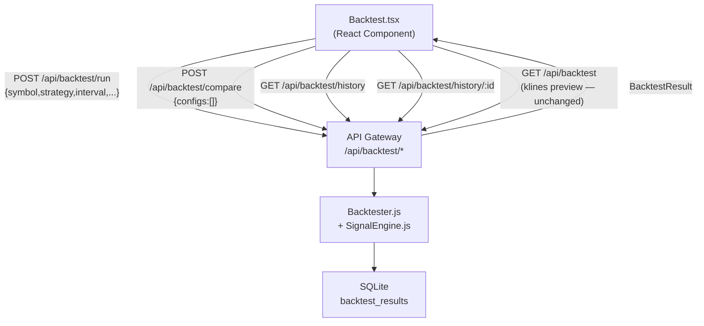

# Design Document: Backtest UI → API Integration

## Overview

ฟีเจอร์นี้ migrate `src/pages/Backtest.tsx` จากการคำนวณ signal/trade/metrics ใน browser ไปเรียก backend API endpoints ที่มีอยู่แล้ว (`POST /api/backtest/run`, `POST /api/backtest/compare`, `GET /api/backtest/history`, `GET /api/backtest/history/:backtestId`) แทน

การเปลี่ยนแปลงหลัก:
- ลบ `technicalindicators` library usage ทั้งหมดออกจาก Backtest.tsx
- ลบ client-side simulation loop (GRID + directional strategies)
- เพิ่ม strategy dropdown ให้ครบ 11 strategies ตาม SignalEngine registry
- เพิ่ม Python strategy support (PYTHON: prefix)
- เพิ่ม Leverage input field
- เพิ่ม History panel (tab ใหม่)
- เพิ่ม Compare Mode
- แสดง metrics ครบถ้วน (sharpeRatio, maxDrawdown, profitFactor, avgWin, avgLoss, maxConsecutiveLosses)
- render trade markers และ equity curve จาก backend response โดยตรง

---

## Architecture



**Data flow สำหรับ "Start Backtest":**
1. User กด "Start Backtest" → UI ส่ง `POST /api/backtest/run` พร้อม BacktestConfig
2. Backend รัน simulation → คืน BacktestResult (trades, metrics, equityCurve)
3. UI รับ response → แสดง metrics, render equityCurve บน chart, สร้าง trade markers จาก trades array
4. ไม่มีการคำนวณใดๆ เพิ่มเติมใน browser

**Chart preview (ไม่เปลี่ยน):**
- `GET /api/backtest?symbol=...&interval=...&limit=1000` ยังคงถูกเรียกเมื่อ symbol/interval เปลี่ยน

---

## Components and Interfaces

### Backtest.tsx — State Changes

State ที่ถูกลบออก:
```ts
// ลบออก — ไม่ต้องการอีก
results: BacktestResults | null          // replaced by BacktestResult
tradeLog: BacktestTrade[]                // replaced by trades from API
storedMarkers: SeriesMarker<Time>[]      // computed from API trades
equityDataMapRef                         // no longer needed (no hover unrealized)
```

State ที่เพิ่มใหม่:
```ts
backtestResult: BacktestResult | null    // full API response
errorMessage: string | null             // API error display
isPythonMode: boolean                   // Python strategy toggle
pythonStrategyName: string              // text input for PYTHON: prefix
leverage: number                        // default 10
compareMode: boolean                    // Compare Mode toggle
compareConfigs: BacktestConfig[]        // list of configs to compare
compareResults: CompareResult[]         // ranked results from /compare
historyList: BacktestSummary[]          // from GET /api/backtest/history
historyLoading: boolean
historyError: string | null
activeTab: 'charts' | 'log' | 'history' | 'compare'
```

### ฟังก์ชันหลักที่เปลี่ยน

```ts
// เดิม: คำนวณ signals + simulation loop ใน browser
// ใหม่: เรียก API แล้ว render ผลลัพธ์
async function handleRunBacktest(): Promise<void>

// ใหม่: สร้าง markers จาก trades array ที่ได้จาก API
function buildMarkersFromTrades(trades: Trade[]): SeriesMarker<Time>[]

// ใหม่: แปลง equityCurve ISO timestamps เป็น Unix seconds
function convertEquityCurve(curve: EquityCurvePoint[]): { time: Time; value: number }[]

// ใหม่: โหลด history list
async function loadHistory(): Promise<void>

// ใหม่: โหลด full result จาก history item
async function loadHistoryItem(backtestId: string): Promise<void>

// ใหม่: รัน compare
async function handleRunCompare(): Promise<void>
```

### ฟังก์ชันที่ถูกลบ

```ts
// ลบออกทั้งหมด — ไม่มี client-side computation
calculateAndDrawIndicators()   // ลบ (ไม่มี technicalindicators)
// GRID simulation loop         // ลบ
// directional strategy loop    // ลบ
```

> หมายเหตุ: indicator overlays (EMA lines, BB bands, RSI panel) ยังคงแสดงบน chart preview ได้ถ้าต้องการ แต่ต้องใช้ข้อมูลจาก klines endpoint แทน technicalindicators library — หรือลบออกเพื่อความเรียบง่าย ตาม requirement ที่ระบุให้ลบ client-side signal computation ทั้งหมด

---

## Data Models

### TypeScript Interfaces (ใหม่ใน Backtest.tsx)

```ts
interface Trade {
  symbol: string;
  type: 'LONG' | 'SHORT';
  entryPrice: number;
  exitPrice: number;
  entryTime: string;       // ISO 8601
  exitTime: string;        // ISO 8601
  pnl: number;             // USDT after fee
  pnlPct: number;          // %
  exitReason: 'TP' | 'SL' | 'Signal Flipped';
}

interface EquityCurvePoint {
  time: string;            // ISO 8601 from API
  value: number;
}

interface BacktestResult {
  backtestId: string;
  symbol: string;
  strategy: string;
  interval: string;
  config: BacktestConfig;
  initialCapital: number;
  finalCapital: number;
  totalPnl: number;
  netPnlPct: number;
  totalTrades: number;
  winRate: number;
  sharpeRatio: number;
  maxDrawdown: number;     // ratio 0-1
  profitFactor: number;
  avgWin: number;          // USDT
  avgLoss: number;         // USDT
  maxConsecutiveLosses: number;
  equityCurve: EquityCurvePoint[];
  trades: Trade[];
  createdAt: string;
}

interface BacktestConfig {
  symbol: string;
  strategy: string;
  interval: string;
  tpPercent: number;
  slPercent: number;
  leverage: number;
  capital: number;
  startDate?: string;
  endDate?: string;
}

interface BacktestSummary {
  backtestId: string;
  symbol: string;
  strategy: string;
  interval: string;
  totalPnl: number;
  winRate: number;
  totalTrades: number;
  createdAt: string;
}

interface CompareResult extends BacktestResult {
  rank: number;
  configLabel: string;
  error?: string;
}
```

---

## UI Design

### Parameter Panel Changes

```
┌─────────────────────────────┐
│ Strategy Tester             │
│ [SymbolSelector]            │
│ Timeframe: [select]         │
│ Start: [date] End: [date]   │
│                             │
│ Strategy: [select ▼]        │  ← 11 JS strategies
│   EMA / RSI / BB / EMA_RSI  │
│   BB_RSI / EMA_BB_RSI / GRID│
│   AI_SCOUTER / EMA_SCALP    │
│   STOCH_RSI / VWAP_SCALP    │
│                             │
│ ┌─ Python Strategy ────────┐│
│ │ [ ] Enable Python Mode   ││  ← toggle
│ │ Name: [____________]     ││  ← shown when enabled
│ │ ⚠ Requires strategy-ai  ││
│ └──────────────────────────┘│
│                             │
│ TP%: [2.0]  SL%: [1.0]     │  ← hidden for GRID
│ Leverage: [10]              │  ← hidden for GRID
│ Capital: [1000]             │
│                             │
│ [Compare Mode ☐]            │
│                             │
│ [▶ Start Backtest]          │
└─────────────────────────────┘
```

### Metrics Bar (เปลี่ยนจาก 7 เป็น 8 metrics)

```
┌──────────┬──────────┬──────────┬──────────┬──────────┬──────────┬──────────┬──────────┐
│ Net PnL  │ Win Rate │ Max DD   │ P.Factor │ Sharpe   │ Avg W/L  │ Max Cons │ Trades   │
│ +$xxx    │ 60% 6W/4L│ 5.2%     │ 1.8      │ 1.2      │+$50/-$30 │ 3        │ 10       │
└──────────┴──────────┴──────────┴──────────┴──────────┴──────────┴──────────┴──────────┘
```

ลบออก: "Peak Float Loss", "Open Positions"
เพิ่มใหม่: "Sharpe Ratio", "Avg Win/Loss", "Max Consecutive Losses"

### Tabs

```
[Charts] [Trade Log (N)] [History] [Compare]
```

### History Tab

```
┌─────────────────────────────────────────────────────────────────┐
│ Symbol    Strategy   Interval  PnL      WinRate  Trades  Date   │
├─────────────────────────────────────────────────────────────────┤
│ BTCUSDT   EMA_SCALP  1h       +$120.5   62%      18      ...   │  ← clickable row
│ ETHUSDT   RSI        4h       -$45.2    40%      10      ...   │
│ ...                                                             │
└─────────────────────────────────────────────────────────────────┘
```

### Compare Mode

เมื่อ Compare Mode เปิด:
1. ปุ่ม "Add Current Config" เพิ่ม config ปัจจุบันเข้า list (สูงสุด 10)
2. แสดง list ของ configs ที่เพิ่มแล้ว (ลบได้)
3. ปุ่ม "Run Comparison" → POST /api/backtest/compare

```
┌─────────────────────────────────────────────────────────────────────────────┐
│ Rank  Config Label        PnL      WinRate  Sharpe  MaxDD   PFactor  Error  │
├─────────────────────────────────────────────────────────────────────────────┤
│  1    EMA_SCALP-1h-2/1   +$200    65%      1.8     3.2%    2.1             │
│  2    RSI-4h-3/1.5       +$120    58%      1.2     5.1%    1.6             │
│  3    BB-1h-2/1          -$50     42%      0.4     8.3%    0.8             │
│  4    STOCH_RSI-15m-2/1  (error)  --       --      --      --      "Insuf" │
└─────────────────────────────────────────────────────────────────────────────┘
```

---

## Chart Rendering Approach

### Equity Curve (จาก API)

```ts
function convertEquityCurve(curve: EquityCurvePoint[]): { time: Time; value: number }[] {
  return curve.map(p => ({
    time: Math.floor(new Date(p.time).getTime() / 1000) as Time,
    value: p.value,
  }));
}
```

- API คืน `time` เป็น ISO 8601 string
- lightweight-charts ต้องการ Unix timestamp (seconds)
- แปลงด้วย `Math.floor(new Date(isoString).getTime() / 1000)`

### Trade Markers (จาก trades array)

```ts
function buildMarkersFromTrades(trades: Trade[]): SeriesMarker<Time>[] {
  const markers: SeriesMarker<Time>[] = [];
  for (const trade of trades) {
    const entryTs = Math.floor(new Date(trade.entryTime).getTime() / 1000) as Time;
    const exitTs  = Math.floor(new Date(trade.exitTime).getTime() / 1000) as Time;

    // Entry marker
    markers.push({
      time: entryTs,
      position: trade.type === 'LONG' ? 'belowBar' : 'aboveBar',
      color: trade.type === 'LONG' ? '#0ecb81' : '#f6465d',
      shape: 'arrowUp',
      text: trade.type,
    });

    // Exit marker
    markers.push({
      time: exitTs,
      position: trade.type === 'LONG' ? 'aboveBar' : 'belowBar',
      color: '#f6465d',
      shape: 'arrowDown',
      text: trade.exitReason,
    });
  }
  return markers.sort((a, b) => (a.time as number) - (b.time as number));
}
```

### Indicator Overlays

หลังจาก migration ไม่มี client-side indicator computation แล้ว ดังนั้น:
- EMA, BB, RSI overlay series จะถูกลบออกจาก chart (ลบ refs และ series creation)
- RSI panel (rsiChartRef) จะถูกลบออก
- Chart preview แสดงเฉพาะ candlestick + trade markers + equity curve

---

## Error Handling

| Scenario | UI Behavior |
|---|---|
| API returns `{ error: "..." }` | แสดง error message ใน errorMessage state, หยุด loading |
| Network failure (fetch throws) | แสดง "Network error — please check your connection" |
| `{ error: "Strategy AI service unavailable" }` | แสดง "Strategy AI service is not available. Please ensure the strategy-ai service is running." |
| History fetch fails | แสดง error ใน History tab |
| equityCurve เป็น [] | เรียก `equitySeriesRef.current?.setData([])` — ไม่ error |
| trades เป็น [] | ไม่สร้าง markers, แสดง empty state ใน Trade Log |
| Compare result มี error field | แสดง error text ใน table row นั้น |

---

## Correctness Properties

*A property is a characteristic or behavior that should hold true across all valid executions of a system — essentially, a formal statement about what the system should do. Properties serve as the bridge between human-readable specifications and machine-verifiable correctness guarantees.*

### Property 1: Request body completeness

*For any* BacktestConfig object, when the user triggers "Start Backtest", the POST /api/backtest/run request body SHALL contain all required fields (`symbol`, `strategy`, `interval`, `tpPercent`, `slPercent`, `leverage`, `capital`) with values matching the current UI state.

**Validates: Requirements 1.1, 1.2**

### Property 2: API error message passthrough

*For any* error message string returned in the API response body's `error` field, the UI SHALL display that exact string to the user.

**Validates: Requirements 1.4, 9.2**

### Property 3: Equity curve ISO-to-Unix conversion

*For any* array of `{ time: string, value: number }` where `time` is a valid ISO 8601 string, the conversion function SHALL produce `{ time: Math.floor(new Date(isoString).getTime() / 1000), value }` for each point — i.e., the round-trip `new Date(unix * 1000).toISOString()` SHALL be within one second of the original ISO string.

**Validates: Requirements 3.1, 3.2**

### Property 4: Trade marker completeness and correctness

*For any* non-empty `trades` array from a BacktestResult, `buildMarkersFromTrades` SHALL produce exactly `2 × trades.length` markers, where for each trade: the entry marker time equals `Math.floor(new Date(trade.entryTime).getTime() / 1000)`, the exit marker time equals `Math.floor(new Date(trade.exitTime).getTime() / 1000)`, LONG entry markers have `position: 'belowBar'` and color `#0ecb81`, SHORT entry markers have `position: 'aboveBar'` and color `#f6465d`, and exit marker text equals `trade.exitReason`.

**Validates: Requirements 4.1, 4.2, 4.3, 4.4**

### Property 5: Trade log field completeness

*For any* `Trade` object from the API response, the rendered trade log row SHALL contain all of: `entryTime`, `exitTime`, `type`, `entryPrice`, `exitPrice`, `pnl` (in USDT), `pnlPct` (as a percentage), and `exitReason`.

**Validates: Requirements 5.1, 5.2, 5.3**

### Property 6: Trade log reverse chronological order

*For any* `trades` array, the trade log SHALL display trades in reverse order by `exitTime` — i.e., for any two adjacent rows i and i+1 in the displayed table, `new Date(row[i].exitTime) >= new Date(row[i+1].exitTime)`.

**Validates: Requirements 5.4**

### Property 7: Python strategy PYTHON: prefix

*For any* non-empty Python strategy name string entered by the user, the POST /api/backtest/run request body `strategy` field SHALL equal `"PYTHON:" + name` exactly.

**Validates: Requirements 11.3**

### Property 8: Strategy key passthrough (no transformation)

*For any* JS strategy key selected from the dropdown (e.g. `"EMA_SCALP"`, `"STOCH_RSI"`), the POST /api/backtest/run request body `strategy` field SHALL equal that key string exactly, without any transformation.

**Validates: Requirements 10.3**

### Property 9: Leverage visibility by strategy

*For any* strategy value, the Leverage input field SHALL be visible if and only if `strategy !== 'GRID'`.

**Validates: Requirements 6.3**

### Property 10: Compare request body completeness

*For any* list of BacktestConfig objects added to Compare Mode (1–10 items), the POST /api/backtest/compare request body `configs` array SHALL contain all added configs in the same order, with each config's fields matching the values entered by the user.

**Validates: Requirements 8.2, 8.3**

### Property 11: Compare results display completeness

*For any* `CompareResult` array returned from the API, the comparison table SHALL display all of `rank`, `configLabel`, `totalPnl`, `winRate`, `sharpeRatio`, `maxDrawdown`, `profitFactor` for each result, and SHALL display the `error` field inline for any result that has one.

**Validates: Requirements 8.4, 8.6**

### Property 12: History summary field completeness

*For any* `BacktestSummary` array returned from `GET /api/backtest/history`, the History tab SHALL render a row for each item containing all of: `symbol`, `strategy`, `interval`, `totalPnl`, `winRate`, `totalTrades`, `createdAt`.

**Validates: Requirements 7.2, 7.3**

### Property 13: State cleared on new run

*For any* UI state that contains a previous `backtestResult`, `errorMessage`, trade markers, and equity curve data, when a new "Start Backtest" is triggered, all of those SHALL be cleared (set to null/empty) before the new API response is processed.

**Validates: Requirements 9.4**

---

## Testing Strategy

### Unit Tests (Vitest)

ทดสอบ pure utility functions ด้วย concrete examples:

- `convertEquityCurve`: ทดสอบ ISO → Unix conversion ด้วย known timestamps
- `buildMarkersFromTrades`: ทดสอบ marker count, colors, positions, text ด้วย synthetic trades
- Strategy dropdown: ทดสอบว่า render ครบ 11 options
- Leverage visibility: ทดสอบ GRID hides leverage, non-GRID shows it
- Empty states: equityCurve=[], trades=[], history=[]
- Error display: network error, API error, strategy-ai unavailable

### Property-Based Tests (fast-check)

ใช้ [fast-check](https://github.com/dubzzz/fast-check) สำหรับ property tests

Configuration: minimum **100 iterations** per property test

แต่ละ property test ต้องมี comment tag:
```ts
// Feature: backtest-ui-api-integration, Property N: <property_text>
```

| Property | Test Description |
|---|---|
| Property 1 | Generate random BacktestConfig, mock fetch, verify request body fields |
| Property 2 | Generate random error strings, mock API response, verify displayed text |
| Property 3 | Generate random ISO timestamps, verify Unix conversion round-trip |
| Property 4 | Generate random Trade arrays, verify marker count, times, colors, text |
| Property 5 | Generate random Trade objects, render row, verify all fields present |
| Property 6 | Generate random Trade arrays with varying exitTime, verify display order |
| Property 7 | Generate random strategy name strings, verify PYTHON: prefix in request |
| Property 8 | For each strategy key, verify exact passthrough in request body |
| Property 9 | For each strategy value, verify leverage input visibility |
| Property 10 | Generate random configs arrays (1-10), verify compare request body |
| Property 11 | Generate random CompareResult arrays, verify all fields rendered |
| Property 12 | Generate random BacktestSummary arrays, verify all fields rendered |
| Property 13 | Set up state with results, trigger new run, verify state cleared |

### Integration Tests

- POST /api/backtest/run → verify BacktestResult shape matches TypeScript interface
- GET /api/backtest/history → verify BacktestSummary array shape
- GET /api/backtest/history/:id → verify full BacktestResult returned
- POST /api/backtest/compare → verify CompareResult array with rank field
