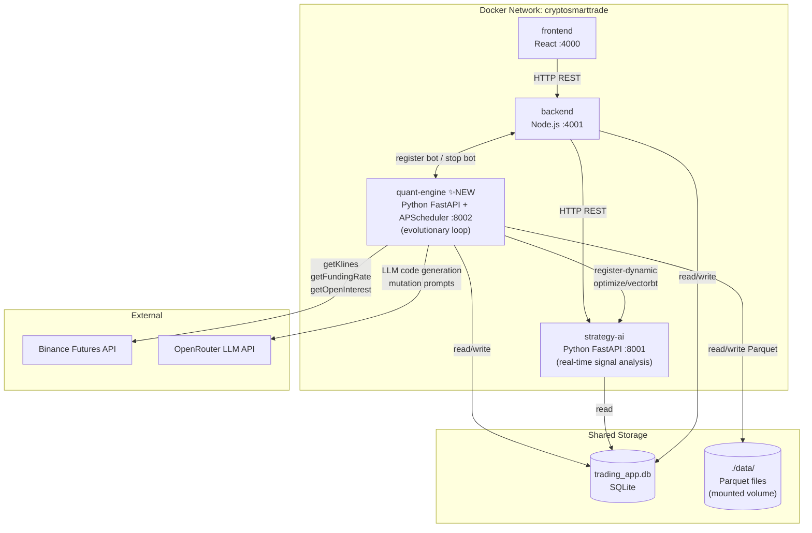
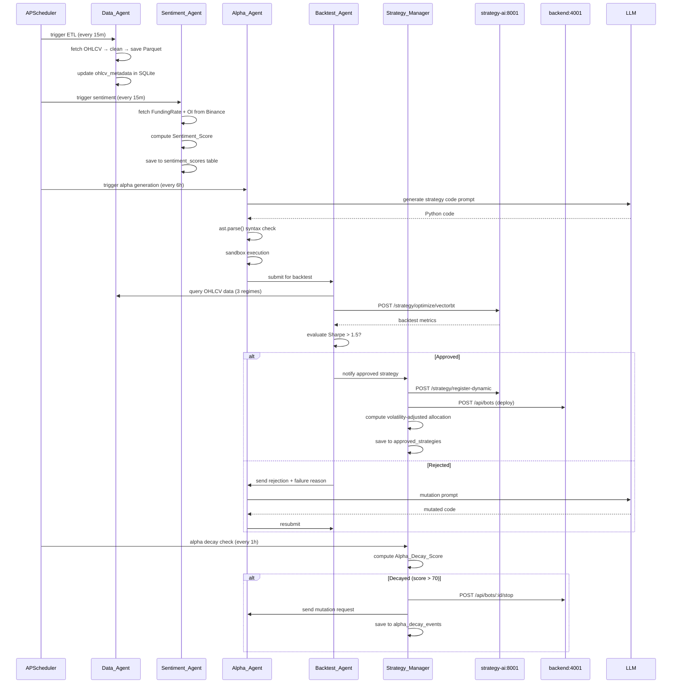
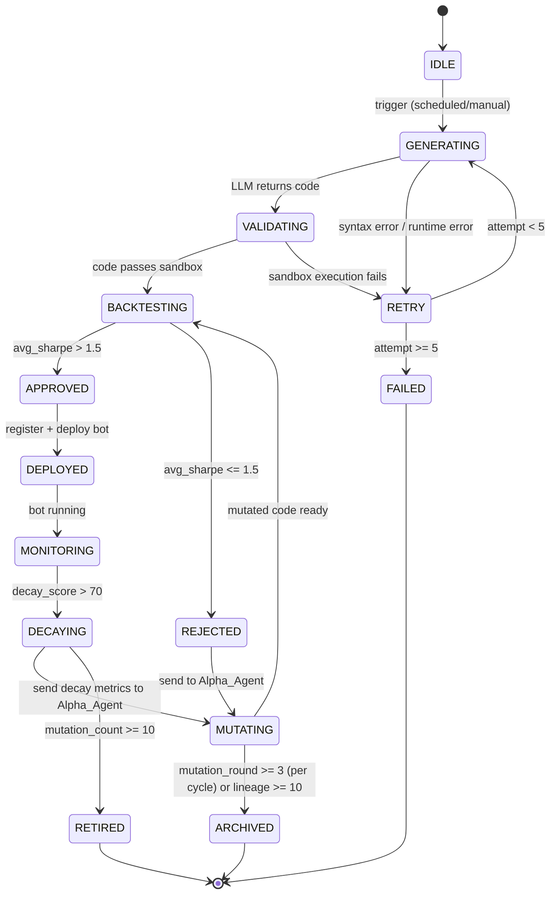

# Design Document: Evolutionary Quant System

## Overview

Evolutionary Quant System เป็น container ใหม่ (`quant-engine`) ที่เพิ่มเข้ามาในระบบ CryptoSmartTrade monorepo เพื่อสร้าง Multi-Agent closed-loop ที่สามารถ research, generate, test, และ deploy trading strategy ได้อัตโนมัติ

ระบบประกอบด้วย 5 agents ที่ทำงานร่วมกัน:
- **Sentiment_Agent** — คำนวณ market sentiment จาก Funding Rate + Open Interest
- **Data_Agent** — ETL pipeline สำหรับ OHLCV data แบบ scheduled
- **Alpha_Agent** — ใช้ LLM สร้าง Python strategy code จาก research
- **Backtest_Agent** — ทดสอบ strategy ด้วย Walk-Forward Optimization
- **Strategy_Manager** — จัดการ portfolio, capital allocation, และ alpha decay detection

Evolutionary loop ทำงานแบบ closed-loop: strategy ที่ล้มเหลวจะถูก mutate และ improve อัตโนมัติ โดยไม่ต้องมี human intervention

### Design Decisions

1. **แยก container ใหม่** (`quant-engine` port 8002) แทนการรวมกับ `strategy-ai` เพราะ evolutionary loop มี long-running tasks (ETL, LLM calls, backtest) ที่ไม่เหมาะกับ latency-sensitive signal analysis ของ `strategy-ai`
2. **Python FastAPI + APScheduler** เพราะ ecosystem ของ Python เหมาะกับ data science (pandas, numpy, vectorbt) และ APScheduler รองรับ cron-style scheduling ใน-process
3. **Parquet storage** สำหรับ OHLCV เพราะรองรับ columnar access ที่เร็วกว่า CSV สำหรับ vectorized backtesting
4. **SQLite shared database** ใช้ database เดิมจาก `packages/data-layer` เพื่อ reuse schema และ migration infrastructure
5. **HTTP inter-agent communication** แทน message queue เพราะ simplicity และ debuggability สำหรับ MVP


## Architecture

### System Architecture Diagram (4 Containers)



### Data Flow: Evolutionary Loop



### Integration Points

| quant-engine เรียก | Target | Endpoint | วัตถุประสงค์ |
|---|---|---|---|
| Register approved strategy | `strategy-ai:8001` | `POST /strategy/register-dynamic` | ลง registry ของ strategy-ai |
| Run VectorBT backtest | `strategy-ai:8001` | `POST /strategy/optimize/vectorbt` | Walk-forward optimization |
| Deploy bot | `backend:4001` | `POST /api/bots` | สร้าง live trading bot |
| Retire bot | `backend:4001` | `PUT /api/bots/:id/stop` | หยุด decayed strategy |
| Fetch OHLCV | Binance API | via httpx directly | ETL pipeline |
| Fetch FundingRate | Binance API | via httpx directly | Sentiment calculation |
| Fetch OpenInterest | Binance API | via httpx directly | Sentiment calculation |


## Components and Interfaces

### Package Structure

```
packages/quant-engine/
├── Dockerfile
├── requirements.txt
├── main.py                     ← FastAPI app + APScheduler bootstrap
├── agents/
│   ├── sentiment_agent.py      ← Req 1: Sentiment Score Pipeline
│   ├── data_agent.py           ← Req 2: OHLCV ETL Pipeline
│   ├── alpha_agent.py          ← Req 3 & 9: Alpha Generation + Mutation
│   ├── backtest_agent.py       ← Req 5: Backtest Approval Gate
│   └── strategy_manager.py    ← Req 6, 7, 8: Registry + Allocation + Decay
├── core/
│   ├── sandbox_executor.py     ← Req 4: Sandbox Execution Environment
│   ├── evolutionary_loop.py    ← Req 10: Orchestration
│   └── registry.py             ← SQLite repository layer
├── data/                       ← Parquet storage (mounted volume)
└── tests/
    ├── test_sentiment_agent.py
    ├── test_data_agent.py
    ├── test_sandbox_executor.py
    ├── test_backtest_agent.py
    ├── test_strategy_manager.py
    └── test_evolutionary_loop.py
```

### 1. Sentiment Agent (`agents/sentiment_agent.py`)

```python
class SentimentAgent:
    def __init__(self, binance_http_client: httpx.AsyncClient, db: sqlite3.Connection):
        ...

    async def compute_score(self, symbol: str) -> SentimentResult:
        """
        ดึง FundingRate + OI จาก Binance แล้วคำนวณ Sentiment_Score
        Returns: SentimentResult(score=float, symbol=str, timestamp=str, components=dict)
        Raises: SentimentFetchError เมื่อ Binance API ล้มเหลว (fallback score=50)
        """

    def _calculate_score(self, funding_rate: float, oi_change_pct: float) -> float:
        """
        Pure function: คำนวณ Sentiment_Score จาก weighted formula
        Invariant: return value ∈ [0.0, 100.0] เสมอ
        """

    async def save_score(self, result: SentimentResult) -> None:
        """บันทึก score ลง sentiment_scores table"""

    async def get_latest(self, symbol: str) -> SentimentResult | None:
        """Query Sentiment_Score ล่าสุดสำหรับ symbol"""

    async def get_history(self, symbol: str, from_ts: str, to_ts: str) -> list[SentimentResult]:
        """Query historical scores ตาม time range"""
```

**API Endpoints ที่ expose:**
- `GET /sentiment/{symbol}` — Sentiment_Score ล่าสุด
- `GET /sentiment/{symbol}/history?from=&to=` — Historical scores

### 2. Data Agent (`agents/data_agent.py`)

```python
class DataAgent:
    def __init__(self, binance_http_client: httpx.AsyncClient, data_dir: Path, db: sqlite3.Connection):
        ...

    async def run_etl(self, symbol: str, interval: str = "15m", limit: int = 1000) -> ETLResult:
        """
        Main ETL pipeline: fetch → clean → save Parquet → update metadata
        Returns: ETLResult(symbol, interval, rows_written, last_updated)
        """

    async def _fetch_ohlcv(self, symbol: str, interval: str, limit: int) -> pd.DataFrame:
        """ดึง OHLCV จาก Binance API ผ่าน httpx"""

    def _clean_data(self, df: pd.DataFrame) -> pd.DataFrame:
        """
        1. Forward-fill missing values
        2. Replace outliers (> 5 std) ด้วย rolling median
        3. Sort by timestamp ascending
        4. Drop duplicate timestamps
        Invariant: output timestamps เรียง ascending และไม่มี duplicate
        """

    def _save_parquet(self, df: pd.DataFrame, symbol: str, interval: str) -> Path:
        """บันทึก DataFrame ลง Parquet file"""

    def read_ohlcv(self, symbol: str, interval: str,
                   from_ts: int | None = None, to_ts: int | None = None) -> pd.DataFrame:
        """
        Query OHLCV data จาก Parquet
        Round-trip invariant: read(write(df)) ≡ df
        """

    async def _update_metadata(self, symbol: str, interval: str, row_count: int) -> None:
        """อัปเดต ohlcv_metadata table"""
```

**API Endpoints ที่ expose:**
- `GET /data/ohlcv/{symbol}?interval=&from=&to=` — Query OHLCV data
- `GET /data/metadata` — ETL metadata ทั้งหมด
- `POST /data/etl/trigger` — Manual ETL trigger

### 3. Alpha Agent (`agents/alpha_agent.py`)

```python
class AlphaAgent:
    def __init__(self, llm_client: OpenRouterHTTPClient, sandbox: SandboxExecutor,
                 strategy_ai_url: str, db: sqlite3.Connection):
        ...

    async def generate_strategy(self, topic: str, context: dict = {}) -> GenerationResult:
        """
        Pipeline: prompt LLM → syntax check → sandbox → register
        Retry ≤ 5 ครั้ง พร้อม self-correction
        Returns: GenerationResult(strategy_key, python_code, attempts, status)
        """

    async def mutate_strategy(self, original_code: str, metrics: dict,
                               failure_reason: str, lineage_id: str) -> GenerationResult:
        """
        Mutation pipeline: ส่ง original + metrics + reason ไปยัง LLM
        Termination invariant: mutation_count ≤ 10 ต่อ lineage
        """

    def _build_generation_prompt(self, topic: str, context: dict) -> str:
        """สร้าง prompt สำหรับ code generation"""

    def _build_mutation_prompt(self, original_code: str, metrics: dict,
                                failure_reason: str) -> str:
        """สร้าง mutation prompt พร้อม failure context"""

    def _validate_code(self, code: str) -> ValidationResult:
        """
        1. ast.parse() syntax check
        2. ตรวจสอบว่ามี class ที่ extend BaseStrategy
        Returns: ValidationResult(valid=bool, error=str|None, class_name=str|None)
        """

    async def _register_strategy(self, key: str, code: str) -> bool:
        """POST /strategy/register-dynamic ไปยัง strategy-ai"""
```

**API Endpoints ที่ expose:**
- `POST /alpha/generate` — Trigger strategy generation
- `POST /alpha/mutate` — Trigger strategy mutation
- `GET /alpha/status` — Generation queue status

### 4. Backtest Agent (`agents/backtest_agent.py`)

```python
class BacktestAgent:
    def __init__(self, data_agent: DataAgent, strategy_ai_url: str, db: sqlite3.Connection):
        ...

    async def evaluate(self, strategy_key: str, python_code: str) -> BacktestResult:
        """
        Walk-Forward evaluation ใน 3 market regimes
        Returns: BacktestResult(approved=bool, avg_sharpe=float, regime_results=dict,
                                rejection_reason=str|None, metrics=dict)
        Determinism invariant: same strategy + same data → same result
        """

    async def _run_walk_forward(self, strategy_key: str,
                                 ohlcv: pd.DataFrame) -> WalkForwardResult:
        """
        POST /strategy/optimize/vectorbt ไปยัง strategy-ai
        แบ่ง data เป็น train/test windows ตามลำดับเวลา
        """

    def _classify_regime(self, ohlcv: pd.DataFrame) -> str:
        """จำแนก market regime: bull | bear | sideways"""

    def _select_regime_data(self, symbol: str) -> dict[str, pd.DataFrame]:
        """เลือก historical data ที่ตรงกับแต่ละ regime"""

    async def _save_result(self, result: BacktestResult) -> None:
        """บันทึกผลลงใน backtest_results table (SQLite)"""
```

**API Endpoints ที่ expose:**
- `POST /backtest/evaluate` — Submit strategy for evaluation
- `GET /backtest/results/{strategy_key}` — Query backtest history

### 5. Strategy Manager (`agents/strategy_manager.py`)

```python
class StrategyManager:
    def __init__(self, db: sqlite3.Connection, backend_url: str, strategy_ai_url: str,
                 alpha_agent: AlphaAgent):
        ...

    async def register_approved(self, strategy_key: str, python_code: str,
                                  metrics: dict) -> None:
        """
        Idempotent upsert ลง approved_strategies table
        Round-trip invariant: register(s) → lookup(s.key) ≡ s
        """

    def compute_allocations(self, total_capital: float) -> dict[str, float]:
        """
        Inverse volatility weighting
        Budget invariant: sum(allocations.values()) ≤ total_capital
        Symmetry invariant: equal volatility → equal allocation
        """

    def _compute_volatility(self, strategy_key: str, lookback_days: int = 30) -> float:
        """std ของ daily returns ใน lookback_days วันล่าสุด"""

    async def check_alpha_decay(self) -> list[str]:
        """
        คำนวณ Alpha_Decay_Score สำหรับทุก active strategy
        Returns: list ของ strategy_keys ที่ decayed
        """

    def compute_decay_score(self, consecutive_losses: int,
                             rolling_sharpe_30d: float,
                             max_drawdown_7d: float) -> float:
        """
        Composite decay score formula
        Invariant: return value ∈ [0.0, 100.0]
        Monotonic invariant: more consecutive_losses → score ไม่ลดลง
        """

    async def retire_strategy(self, strategy_key: str, decay_metrics: dict) -> None:
        """Mark decayed, stop bot, send to Alpha_Agent for mutation"""

    async def get_active_strategies(self) -> list[ApprovedStrategy]:
        """Query active strategies จาก approved_strategies table"""
```

**API Endpoints ที่ expose:**
- `GET /strategies` — List all strategies (filter by status, sharpe)
- `GET /strategies/{key}` — Strategy detail
- `POST /strategies/{key}/retire` — Manual retirement
- `GET /allocations` — Current capital allocations

### 6. Sandbox Executor (`core/sandbox_executor.py`)

```python
IMPORT_WHITELIST = frozenset({
    "numpy", "pandas", "vectorbt", "math",
    "statistics", "collections", "itertools"
})

class RestrictedImporter:
    """Custom __import__ hook ที่ block modules นอก whitelist"""

    def find_module(self, name: str, path=None):
        base = name.split(".")[0]
        if base not in IMPORT_WHITELIST:
            return self  # intercept
        return None  # allow default import

    def load_module(self, name: str):
        raise ImportError(
            f"Import '{name}' is not allowed. "
            f"Whitelist: {sorted(IMPORT_WHITELIST)}"
        )

class SandboxExecutor:
    def __init__(self, timeout_seconds: int = 30):
        self.timeout = timeout_seconds

    def execute(self, code: str) -> SandboxResult:
        """
        Execute code ใน isolated namespace พร้อม:
        1. RestrictedImporter (block non-whitelist imports)
        2. 30-second timeout via threading.Timer
        3. Isolated namespace (ไม่มี __builtins__ file/network access)
        Returns: SandboxResult(success=bool, output=any, error=str|None)
        Security invariant: non-whitelist imports → ImportError เสมอ
        """

    def _build_restricted_namespace(self) -> dict:
        """สร้าง namespace ที่ปลอดภัย: ไม่มี open, os, sys, subprocess, socket"""
```

### 7. Evolutionary Loop (`core/evolutionary_loop.py`)

```python
class EvolutionaryLoop:
    def __init__(self, agents: AgentRegistry, db: sqlite3.Connection):
        self.sentiment_agent = agents.sentiment
        self.data_agent = agents.data
        self.alpha_agent = agents.alpha
        self.backtest_agent = agents.backtest
        self.strategy_manager = agents.strategy_manager
        self._agent_status: dict[str, AgentStatus] = {}

    async def run_generation_cycle(self, topic: str) -> CycleResult:
        """
        Full pipeline: Alpha → Backtest → Strategy_Manager
        Error handling: บันทึก error พร้อม agent_name, timestamp, input_payload
        """

    async def run_decay_check(self) -> None:
        """ตรวจสอบ alpha decay สำหรับทุก active strategy"""

    def get_status(self) -> dict[str, AgentStatus]:
        """
        Returns สถานะปัจจุบันของแต่ละ agent: idle | running | error | timeout
        """

    async def _call_with_timeout(self, agent_name: str, coro, timeout: int = 60):
        """Wrapper ที่ mark agent ว่า timeout หากไม่ตอบสนองภายใน 60 วินาที"""
```

**API Endpoints ที่ expose:**
- `GET /status` — Agent statuses ทั้งหมด
- `POST /loop/trigger` — Manual trigger generation cycle
- `GET /loop/history` — Cycle history

### 8. FastAPI Main (`main.py`)

```python
app = FastAPI(title="Quant Engine - Evolutionary Trading System")

# APScheduler jobs
scheduler = AsyncIOScheduler()
scheduler.add_job(data_agent.run_etl_all,    "cron", minute="*/15")
scheduler.add_job(sentiment_agent.run_all,   "cron", minute="*/15")
scheduler.add_job(loop.run_generation_cycle, "cron", hour="*/6")
scheduler.add_job(loop.run_decay_check,      "cron", hour="*/1")

# Mount routers
app.include_router(sentiment_router, prefix="/sentiment")
app.include_router(data_router,      prefix="/data")
app.include_router(alpha_router,     prefix="/alpha")
app.include_router(backtest_router,  prefix="/backtest")
app.include_router(strategy_router,  prefix="/strategies")
app.include_router(loop_router,      prefix="/loop")

@app.get("/health")
async def health(): ...

@app.get("/status")
async def status(): ...
```


## Data Models

### Pydantic Schemas

```python
# ─── Sentiment ────────────────────────────────────────────────────────────────

class SentimentResult(BaseModel):
    symbol: str
    score: float                    # [0.0, 100.0]
    funding_rate: float
    oi_change_pct: float
    timestamp: str                  # ISO 8601
    components: dict[str, float]    # debug: {"funding_component": x, "oi_component": y}

# ─── OHLCV ────────────────────────────────────────────────────────────────────

class OHLCVMetadata(BaseModel):
    symbol: str
    interval: str
    last_updated: str
    row_count: int
    parquet_path: str

class ETLResult(BaseModel):
    symbol: str
    interval: str
    rows_written: int
    last_updated: str
    success: bool
    error: str | None = None

# ─── Alpha Generation ─────────────────────────────────────────────────────────

class GenerationResult(BaseModel):
    strategy_key: str
    python_code: str
    attempts: int                   # ≤ 5
    status: Literal["success", "generation_failed"]
    lineage_id: str                 # UUID สำหรับ track evolution

class ValidationResult(BaseModel):
    valid: bool
    error: str | None = None
    class_name: str | None = None

class SandboxResult(BaseModel):
    success: bool
    output: Any | None = None
    error: str | None = None
    execution_time_ms: float

# ─── Backtest ─────────────────────────────────────────────────────────────────

class RegimeResult(BaseModel):
    regime: Literal["bull", "bear", "sideways"]
    sharpe: float
    max_drawdown: float
    win_rate: float
    total_trades: int

class BacktestResult(BaseModel):
    strategy_key: str
    approved: bool
    avg_sharpe: float
    regime_results: list[RegimeResult]
    rejection_reason: str | None = None
    worst_regime: str | None = None
    metrics: dict[str, float]       # sharpe, max_drawdown, win_rate, profit_factor
    tested_at: str

# ─── Strategy Registry ────────────────────────────────────────────────────────

class ApprovedStrategy(BaseModel):
    strategy_key: str
    python_code: str
    backtest_metrics: dict[str, float]
    approved_at: str
    status: Literal["active", "retired", "decayed"]
    lineage_id: str
    mutation_count: int = 0         # ≤ 10

class StrategyAllocation(BaseModel):
    strategy_key: str
    weight: float                   # [0.0, 1.0]
    capital_usdt: float
    volatility: float

# ─── Alpha Decay ──────────────────────────────────────────────────────────────

class DecayMetrics(BaseModel):
    consecutive_losses: int
    rolling_sharpe_30d: float
    max_drawdown_7d: float
    decay_score: float              # [0.0, 100.0]

class DecayEvent(BaseModel):
    strategy_key: str
    decay_score: float
    metrics: DecayMetrics
    timestamp: str
    action: Literal["retired", "mutation_triggered"]

# ─── Orchestration ────────────────────────────────────────────────────────────

class AgentStatus(BaseModel):
    name: str
    state: Literal["idle", "running", "error", "timeout"]
    last_run: str | None = None
    last_error: str | None = None

class CycleResult(BaseModel):
    cycle_id: str
    started_at: str
    completed_at: str
    strategies_generated: int
    strategies_approved: int
    strategies_rejected: int
    errors: list[dict]
```

### Database Schema (SQLite — New Tables)

```sql
-- ─── Approved Strategy Registry ──────────────────────────────────────────────
CREATE TABLE IF NOT EXISTS approved_strategies (
    strategy_key    TEXT PRIMARY KEY,
    python_code     TEXT NOT NULL,
    backtest_metrics TEXT NOT NULL,     -- JSON: {sharpe, max_drawdown, win_rate, ...}
    approved_at     TEXT NOT NULL,      -- ISO 8601
    status          TEXT NOT NULL DEFAULT 'active',  -- active | retired | decayed
    lineage_id      TEXT NOT NULL,      -- UUID
    mutation_count  INTEGER NOT NULL DEFAULT 0,
    bot_id          TEXT,               -- backend bot ID หลัง deploy
    updated_at      TEXT NOT NULL
);

CREATE INDEX IF NOT EXISTS idx_approved_strategies_status
    ON approved_strategies(status);
CREATE INDEX IF NOT EXISTS idx_approved_strategies_lineage
    ON approved_strategies(lineage_id);

-- ─── Sentiment Scores ─────────────────────────────────────────────────────────
CREATE TABLE IF NOT EXISTS sentiment_scores (
    id              INTEGER PRIMARY KEY AUTOINCREMENT,
    symbol          TEXT NOT NULL,
    score           REAL NOT NULL,      -- [0.0, 100.0]
    funding_rate    REAL NOT NULL,
    oi_change_pct   REAL NOT NULL,
    components      TEXT NOT NULL,      -- JSON
    timestamp       TEXT NOT NULL       -- ISO 8601
);

CREATE INDEX IF NOT EXISTS idx_sentiment_scores_symbol_ts
    ON sentiment_scores(symbol, timestamp);

-- ─── OHLCV Metadata ───────────────────────────────────────────────────────────
CREATE TABLE IF NOT EXISTS ohlcv_metadata (
    id              INTEGER PRIMARY KEY AUTOINCREMENT,
    symbol          TEXT NOT NULL,
    interval        TEXT NOT NULL,
    last_updated    TEXT NOT NULL,
    row_count       INTEGER NOT NULL,
    parquet_path    TEXT NOT NULL,
    UNIQUE(symbol, interval)
);

-- ─── Alpha Decay Events ───────────────────────────────────────────────────────
CREATE TABLE IF NOT EXISTS alpha_decay_events (
    id              INTEGER PRIMARY KEY AUTOINCREMENT,
    strategy_key    TEXT NOT NULL,
    decay_score     REAL NOT NULL,
    consecutive_losses INTEGER NOT NULL,
    rolling_sharpe_30d REAL NOT NULL,
    max_drawdown_7d REAL NOT NULL,
    action          TEXT NOT NULL,      -- retired | mutation_triggered
    timestamp       TEXT NOT NULL
);

-- ─── Mutation History ─────────────────────────────────────────────────────────
CREATE TABLE IF NOT EXISTS mutation_history (
    id              INTEGER PRIMARY KEY AUTOINCREMENT,
    lineage_id      TEXT NOT NULL,      -- UUID ของ strategy family
    parent_key      TEXT NOT NULL,
    child_key       TEXT NOT NULL,
    mutation_round  INTEGER NOT NULL,   -- 1-10
    failure_reason  TEXT,
    decay_metrics   TEXT,               -- JSON
    created_at      TEXT NOT NULL
);

CREATE INDEX IF NOT EXISTS idx_mutation_history_lineage
    ON mutation_history(lineage_id);
```


## Sentiment Score Formula

### Weighted Formula

Sentiment_Score คำนวณจาก 2 components โดยใช้ **contrarian logic** (Funding Rate สูง = market overbought = bearish signal):

```
funding_component = clamp((-funding_rate / 0.002) * 50 + 50, 0, 100)
oi_component      = clamp((oi_change_pct / 10.0) * 50 + 50, 0, 100)

Sentiment_Score   = 0.6 × funding_component + 0.4 × oi_component
```

**อธิบาย:**
- `funding_rate` อยู่ในช่วงปกติ [-0.003, +0.003] (หน่วย: decimal เช่น 0.001 = 0.1%)
- `oi_change_pct` คือ % change ของ Open Interest เทียบกับ period ก่อนหน้า
- Weight 60:40 เพราะ Funding Rate เป็น indicator ที่ reliable กว่า OI change ใน crypto futures
- `clamp(x, 0, 100)` รับประกัน invariant ว่า score ∈ [0, 100] เสมอ

**ตัวอย่าง:**
| Funding Rate | OI Change | Funding Comp | OI Comp | Score | Interpretation |
|---|---|---|---|---|---|
| +0.002 (0.2%) | +5% | 0 | 75 | 30 | Bearish (contrarian) |
| -0.002 (-0.2%) | -5% | 100 | 25 | 70 | Bullish (contrarian) |
| 0.0 | 0% | 50 | 50 | 50 | Neutral |
| +0.001 (0.1%) | +10% | 25 | 100 | 55 | Slightly bearish |

**Boundary Conditions (Req 1.3, 1.4):**
- Funding Rate > +0.1% (+0.001): `funding_component < 25` → Score < 40 ✓
- Funding Rate < -0.1% (-0.001): `funding_component > 75` → Score > 60 ✓

## Alpha Decay Score Formula

### Composite Decay Score

```
loss_score     = min(consecutive_losses / 10.0, 1.0) × 40
sharpe_score   = clamp((1.5 - rolling_sharpe_30d) / 3.0, 0, 1) × 40
drawdown_score = clamp(max_drawdown_7d / 0.20, 0, 1) × 20

Alpha_Decay_Score = loss_score + sharpe_score + drawdown_score
```

**อธิบาย:**
- `consecutive_losses`: จำนวน loss ติดต่อกัน (weight 40%) — 10 losses = max score
- `rolling_sharpe_30d`: Sharpe Ratio 30 วัน (weight 40%) — Sharpe ≤ -1.5 = max score
- `max_drawdown_7d`: Max drawdown ใน 7 วัน (weight 20%) — drawdown ≥ 20% = max score
- `clamp(x, 0, 1)` รับประกัน invariant ว่า score ∈ [0, 100] เสมอ

**Monotonic Property:** เมื่อ `consecutive_losses` เพิ่มขึ้น `loss_score` เพิ่มขึ้น → `Alpha_Decay_Score` ไม่ลดลง ✓

**Threshold:** score > 70 → trigger decay (default)

## Sandbox Security Design

### RestrictedImporter Implementation

```python
import sys
import threading
from types import ModuleType

IMPORT_WHITELIST = frozenset({
    "numpy", "np",          # alias
    "pandas", "pd",         # alias
    "vectorbt", "vbt",      # alias
    "math", "statistics",
    "collections", "itertools",
})

BLOCKED_BUILTINS = {
    "open", "exec", "eval", "compile",
    "__import__", "breakpoint",
}

class RestrictedImporter:
    """
    Meta path finder ที่ intercept import statements
    และ block modules นอก whitelist
    """
    def find_module(self, fullname: str, path=None):
        base_module = fullname.split(".")[0]
        if base_module not in IMPORT_WHITELIST:
            return self     # เราจะ handle เอง (block)
        return None         # ปล่อยให้ default importer จัดการ

    def load_module(self, fullname: str) -> ModuleType:
        raise ImportError(
            f"Security violation: import '{fullname}' is blocked. "
            f"Allowed modules: {sorted(IMPORT_WHITELIST)}"
        )

def _build_safe_builtins() -> dict:
    """สร้าง __builtins__ ที่ปลอดภัย: ลบ dangerous functions ออก"""
    import builtins
    safe = vars(builtins).copy()
    for name in BLOCKED_BUILTINS:
        safe.pop(name, None)
    return safe

class SandboxExecutor:
    def execute(self, code: str, timeout: int = 30) -> SandboxResult:
        result = {"success": False, "output": None, "error": None}
        exception_holder = []

        def _run():
            # Install restricted importer
            sys.meta_path.insert(0, RestrictedImporter())
            try:
                namespace = {
                    "__builtins__": _build_safe_builtins(),
                    "__name__": "__sandbox__",
                }
                exec(code, namespace)
                result["success"] = True
                result["output"] = namespace
            except ImportError as e:
                result["error"] = f"ImportError: {e}"
            except Exception as e:
                result["error"] = f"{type(e).__name__}: {e}"
            finally:
                # Remove restricted importer
                sys.meta_path[:] = [
                    m for m in sys.meta_path
                    if not isinstance(m, RestrictedImporter)
                ]

        thread = threading.Thread(target=_run, daemon=True)
        thread.start()
        thread.join(timeout=timeout)

        if thread.is_alive():
            return SandboxResult(
                success=False,
                error=f"Execution timeout after {timeout}s"
            )

        return SandboxResult(**result)
```

### Security Layers

1. **Import Whitelist** — `RestrictedImporter` block ทุก module นอก whitelist
2. **Builtin Restriction** — ลบ `open`, `exec`, `eval`, `compile` ออกจาก `__builtins__`
3. **Isolated Namespace** — code ทำงานใน namespace แยก ไม่มี access ถึง global state
4. **Timeout** — `threading.Timer` terminate thread หลัง 30 วินาที
5. **No Network** — `socket`, `requests`, `httpx` ถูก block โดย whitelist

## Evolutionary Loop State Machine



**States:**
| State | Description |
|---|---|
| `IDLE` | รอ trigger จาก scheduler หรือ manual |
| `GENERATING` | Alpha_Agent กำลัง call LLM |
| `VALIDATING` | ตรวจสอบ syntax + sandbox execution |
| `RETRY` | LLM error → self-correction prompt (max 5 ครั้ง) |
| `BACKTESTING` | Backtest_Agent กำลัง run walk-forward |
| `APPROVED` | Sharpe > 1.5 → ส่งต่อ Strategy_Manager |
| `DEPLOYED` | Bot ถูก deploy ใน backend |
| `MONITORING` | Bot กำลัง trade, decay check ทุก 1 ชั่วโมง |
| `DECAYING` | Decay score > 70 → หยุด allocation |
| `MUTATING` | Alpha_Agent กำลัง mutate strategy |
| `FAILED` | Generation ล้มเหลว 5 ครั้ง |
| `ARCHIVED` | Mutation ล้มเหลว 3 รอบ (per cycle) |
| `RETIRED` | Mutation ครบ 10 ครั้ง (lineage limit) |


## Docker Compose Changes

### เพิ่ม service `quant-engine` และ shared volume

```yaml
# docker-compose.yml — เพิ่มส่วนนี้

services:
  # ... existing services (backend, frontend, strategy-ai) ...

  quant-engine:
    build:
      context: ./packages/quant-engine
    container_name: cryptosmarttrade-quant
    ports:
      - "8002:8002"
    environment:
      - BACKEND_URL=http://backend:4001
      - STRATEGY_AI_URL=http://strategy-ai:8000
      - OPENROUTER_API_KEY=${OPENROUTER_API_KEY:-}
      - OPENROUTER_MODEL=${OPENROUTER_MODEL:-meta-llama/llama-3.1-8b-instruct}
      - BINANCE_API_KEY=${BINANCE_API_KEY:-}
      - BINANCE_API_SECRET=${BINANCE_API_SECRET:-}
      - DATA_DIR=/app/data
      - DB_PATH=/app/trading_app.db
      - ETL_SYMBOLS=${ETL_SYMBOLS:-BTCUSDT,ETHUSDT,SOLUSDT}
      - ETL_INTERVAL=${ETL_INTERVAL:-15m}
      - DECAY_THRESHOLD=${DECAY_THRESHOLD:-70}
    volumes:
      - ./trading_app.db:/app/trading_app.db   # shared SQLite
      - quant_data:/app/data                    # Parquet storage
    depends_on:
      - backend
      - strategy-ai
    restart: always
    command: uvicorn main:app --host 0.0.0.0 --port 8002

volumes:
  quant_data:
    driver: local
    driver_opts:
      type: none
      o: bind
      device: ./data
```

### Dockerfile (`packages/quant-engine/Dockerfile`)

```dockerfile
FROM python:3.11-slim

WORKDIR /app

COPY requirements.txt .
RUN pip install --no-cache-dir -r requirements.txt

COPY . .

EXPOSE 8002
CMD ["uvicorn", "main:app", "--host", "0.0.0.0", "--port", "8002"]
```

### requirements.txt

```
fastapi==0.111.0
uvicorn[standard]==0.29.0
apscheduler==3.10.4
httpx==0.27.0
pandas==2.2.2
numpy==1.26.4
pyarrow==16.0.0       # Parquet support
hypothesis==6.100.0   # Property-based testing
pytest==8.2.0
pytest-asyncio==0.23.6
```


## Correctness Properties

*A property is a characteristic or behavior that should hold true across all valid executions of a system — essentially, a formal statement about what the system should do. Properties serve as the bridge between human-readable specifications and machine-verifiable correctness guarantees.*

ระบบนี้เหมาะกับ Property-Based Testing เพราะมี pure functions หลายตัว (sentiment formula, decay score, capital allocation, sandbox security) ที่มี universal properties ที่ชัดเจนและ input space กว้าง

**Property Reflection (ก่อนเขียน properties):**

จาก prework analysis พบว่า properties ที่ซ้ำซ้อนกัน:
- Req 1.7 และ Req 11.1 เป็น invariant เดียวกัน (sentiment score ∈ [0,100]) → รวมเป็น Property 1
- Req 3.8, 4.2, 4.6 ล้วนเป็น security invariant เดียวกัน (non-whitelist import → ImportError) → รวมเป็น Property 3
- Req 3.9 และ Req 11.8 เป็น termination invariant เดียวกัน (retry ≤ 5) → รวมเป็น Property 8
- Req 2.7 (timestamp ordering) และ Req 2.8 (round-trip) เป็น properties แยกกันที่ไม่ซ้ำซ้อน → คงไว้ทั้งคู่
- Req 5.3 และ 5.4 (approval decision) สามารถรวมเป็น property เดียวที่ครอบคลุม Sharpe threshold ทั้งสองทิศทาง → รวมเป็น Property 4
- Req 7.5 (budget invariant) และ Req 7.6 (symmetry) เป็น properties แยกกัน → คงไว้ทั้งคู่

หลัง reflection เหลือ **10 properties** ที่ไม่ซ้ำซ้อน:

---

### Property 1: Sentiment Score Invariant

*For any* valid `(funding_rate, oi_change_pct)` input pair, the `_calculate_score()` function SHALL return a value in the range `[0.0, 100.0]`

**Validates: Requirements 1.2, 1.7, 11.1**

---

### Property 2: OHLCV Round-Trip Preservation

*For any* valid OHLCV DataFrame ที่เขียนลง Parquet แล้วอ่านกลับมา, ข้อมูลที่ได้ SHALL มี row count, column names, และ values เทียบเท่ากับ DataFrame ต้นฉบับ (tolerance ±1e-9 สำหรับ float)

**Validates: Requirements 2.8, 11.2**

---

### Property 3: Sandbox Security Invariant

*For any* Python code string ที่มี import statement สำหรับ module นอก whitelist (`numpy`, `pandas`, `vectorbt`, `math`, `statistics`, `collections`, `itertools`), `SandboxExecutor.execute()` SHALL raise `ImportError` และ return `SandboxResult(success=False)`

**Validates: Requirements 3.8, 4.2, 4.6, 11.3**

---

### Property 4: Backtest Approval Determinism

*For any* strategy code และ OHLCV dataset คู่เดิม, การรัน `BacktestAgent.evaluate()` สองครั้งด้วย input เดิม SHALL ได้ `avg_sharpe` ที่เท่ากัน (tolerance ±0.001) และ `approved` decision เดิมเสมอ

**Validates: Requirements 5.7, 11.4**

---

### Property 5: Capital Budget Invariant

*For any* set ของ N active strategies ที่มี volatility ใดๆ และ `total_capital` ใดๆ, `compute_allocations()` SHALL return allocations ที่มี `sum(allocations.values()) ≤ total_capital` เสมอ

**Validates: Requirements 7.5, 11.5**

---

### Property 6: Strategy Registry Round-Trip

*For any* `ApprovedStrategy` object, การ `register_approved(s)` แล้ว query ด้วย `s.strategy_key` SHALL return object ที่มี `strategy_key`, `python_code`, `backtest_metrics`, และ `status` เทียบเท่ากับ object ที่ register ไป

**Validates: Requirements 6.5, 11.6**

---

### Property 7: Alpha Decay Score Monotonicity

*For any* strategy state ที่มี `consecutive_losses = n`, การเพิ่ม `consecutive_losses` เป็น `n+1` (โดยคง `rolling_sharpe_30d` และ `max_drawdown_7d` เดิม) SHALL ทำให้ `compute_decay_score()` return ค่าที่ ≥ ค่าเดิม

**Validates: Requirements 8.7, 11.7**

---

### Property 8: Alpha Generation Termination

*For any* generation request ที่ LLM ส่ง code ที่ fail ทุกครั้ง, `AlphaAgent.generate_strategy()` SHALL หยุด retry และ return `status="generation_failed"` เมื่อ `attempts` ถึง 5 โดยไม่เกิน 5 ครั้งเสมอ

**Validates: Requirements 3.6, 3.9, 11.8**

---

### Property 9: Equal Volatility Equal Allocation

*For any* set ของ N strategies (N ≥ 2) ที่มี volatility เท่ากันทุกตัว, `compute_allocations()` SHALL return capital allocation ที่เท่ากันสำหรับทุก strategy (tolerance ±0.01 USDT)

**Validates: Requirements 7.6, 11.9**

---

### Property 10: Sentiment Score Idempotence

*For any* `(funding_rate, oi_change_pct)` input pair, การเรียก `_calculate_score()` ด้วย input เดิมหลายครั้ง SHALL return ค่าเดิมทุกครั้ง (pure function, no side effects)

**Validates: Requirements 11.10**


## Error Handling

### Error Taxonomy

| Error Type | Component | Handling Strategy |
|---|---|---|
| `BinanceAPIError` | Sentiment_Agent, Data_Agent | Retry 3 ครั้ง → fallback (score=50 / skip ETL) |
| `LLMAPIError` | Alpha_Agent | Retry ≤ 5 ครั้ง → mark `generation_failed` |
| `SyntaxError` | Alpha_Agent | ส่ง stack trace กลับ LLM พร้อม self-correction prompt |
| `ImportError` | Sandbox_Executor | Return `SandboxResult(success=False)` ทันที |
| `TimeoutError` | Sandbox_Executor | Terminate thread → return timeout error |
| `BacktestError` | Backtest_Agent | Log error + mark strategy `backtest_failed` |
| `RegistrationError` | Strategy_Manager | Retry 3 ครั้ง → log + skip deployment |
| `AgentTimeoutError` | Evolutionary_Loop | Mark agent `timeout` → skip to next step |
| `DatabaseError` | ทุก agent | Log + raise (critical — ต้องแก้ไข) |

### Error Logging Format

ทุก error ที่เกิดใน pipeline ต้องบันทึกใน format นี้:

```python
{
    "event": "agent_error",
    "agent_name": str,          # "alpha_agent" | "backtest_agent" | ...
    "timestamp": str,           # ISO 8601
    "input_payload": dict,      # sanitized input ที่ทำให้เกิด error
    "error_type": str,          # class name ของ exception
    "error_message": str,
    "stack_trace": str,
    "cycle_id": str             # UUID ของ generation cycle
}
```

### Fallback Behaviors

```python
# Sentiment_Agent: Binance API ล้มเหลว
async def compute_score(self, symbol: str) -> SentimentResult:
    try:
        funding = await self._fetch_funding_rate(symbol)
        oi = await self._fetch_oi_change(symbol)
        score = self._calculate_score(funding, oi)
    except Exception as e:
        logger.error(f"[SentimentAgent] fetch failed: {e}")
        score = 50.0  # neutral fallback
        funding, oi = 0.0, 0.0
    return SentimentResult(symbol=symbol, score=score, ...)

# Data_Agent: ETL ล้มเหลว 3 ครั้ง
async def run_etl(self, symbol: str, ...) -> ETLResult:
    for attempt in range(3):
        try:
            df = await self._fetch_ohlcv(symbol, ...)
            ...
            return ETLResult(success=True, ...)
        except Exception as e:
            if attempt == 2:
                await self._send_alert(f"ETL failed 3x for {symbol}: {e}")
                return ETLResult(success=False, error=str(e), ...)
            await asyncio.sleep(2 ** attempt)  # exponential backoff
```


## Testing Strategy

### Dual Testing Approach

ใช้ทั้ง unit tests และ property-based tests ควบคู่กัน:
- **Unit tests** — ตรวจสอบ specific examples, edge cases, integration points
- **Property tests** — ตรวจสอบ universal properties ด้วย random inputs (≥ 100 iterations)

### Property-Based Testing Library

ใช้ **Hypothesis** (Python) เพราะ:
- เป็น standard PBT library สำหรับ Python
- รองรับ custom strategies สำหรับ generate pandas DataFrame, numpy arrays
- Shrinking: เมื่อ test fail จะหา minimal failing example อัตโนมัติ
- Integration กับ pytest ได้ดี

### Property Test Structure

```python
# tests/test_sentiment_agent.py
from hypothesis import given, settings
from hypothesis import strategies as st
from agents.sentiment_agent import SentimentAgent

# Feature: evolutionary-quant-system, Property 1: Sentiment Score Invariant
@given(
    funding_rate=st.floats(min_value=-0.01, max_value=0.01, allow_nan=False),
    oi_change_pct=st.floats(min_value=-50.0, max_value=50.0, allow_nan=False),
)
@settings(max_examples=200)
def test_sentiment_score_invariant(funding_rate, oi_change_pct):
    """Property 1: Sentiment Score ∈ [0, 100] เสมอ"""
    agent = SentimentAgent.__new__(SentimentAgent)
    score = agent._calculate_score(funding_rate, oi_change_pct)
    assert 0.0 <= score <= 100.0, f"Score {score} out of range for fr={funding_rate}, oi={oi_change_pct}"

# Feature: evolutionary-quant-system, Property 10: Sentiment Score Idempotence
@given(
    funding_rate=st.floats(min_value=-0.01, max_value=0.01, allow_nan=False),
    oi_change_pct=st.floats(min_value=-50.0, max_value=50.0, allow_nan=False),
)
@settings(max_examples=200)
def test_sentiment_score_idempotence(funding_rate, oi_change_pct):
    """Property 10: same inputs → same output (pure function)"""
    agent = SentimentAgent.__new__(SentimentAgent)
    score1 = agent._calculate_score(funding_rate, oi_change_pct)
    score2 = agent._calculate_score(funding_rate, oi_change_pct)
    assert score1 == score2
```

```python
# tests/test_data_agent.py
from hypothesis import given, settings
from hypothesis import strategies as st
import pandas as pd
import numpy as np
from agents.data_agent import DataAgent

ohlcv_strategy = st.fixed_dictionaries({
    "timestamp": st.lists(
        st.integers(min_value=1_600_000_000_000, max_value=1_800_000_000_000),
        min_size=10, max_size=500, unique=True
    ).map(sorted),
    "open":   st.lists(st.floats(min_value=0.01, max_value=100_000.0, allow_nan=False), min_size=10, max_size=500),
    "high":   st.lists(st.floats(min_value=0.01, max_value=100_000.0, allow_nan=False), min_size=10, max_size=500),
    "low":    st.lists(st.floats(min_value=0.01, max_value=100_000.0, allow_nan=False), min_size=10, max_size=500),
    "close":  st.lists(st.floats(min_value=0.01, max_value=100_000.0, allow_nan=False), min_size=10, max_size=500),
    "volume": st.lists(st.floats(min_value=0.0, max_value=1_000_000.0, allow_nan=False), min_size=10, max_size=500),
})

# Feature: evolutionary-quant-system, Property 2: OHLCV Round-Trip Preservation
@given(raw=ohlcv_strategy)
@settings(max_examples=100)
def test_ohlcv_round_trip(raw, tmp_path):
    """Property 2: write Parquet → read back ≡ original DataFrame"""
    n = len(raw["timestamp"])
    df = pd.DataFrame({k: v[:n] for k, v in raw.items()})
    agent = DataAgent.__new__(DataAgent)
    agent.data_dir = tmp_path
    path = agent._save_parquet(df, "BTCUSDT", "15m")
    df_back = agent.read_ohlcv("BTCUSDT", "15m")
    assert df.shape == df_back.shape
    assert list(df.columns) == list(df_back.columns)
    pd.testing.assert_frame_equal(df, df_back, check_exact=False, atol=1e-9)
```

```python
# tests/test_sandbox_executor.py
from hypothesis import given, settings
from hypothesis import strategies as st
from core.sandbox_executor import SandboxExecutor, IMPORT_WHITELIST

# Feature: evolutionary-quant-system, Property 3: Sandbox Security Invariant
@given(
    module_name=st.text(
        alphabet=st.characters(whitelist_categories=("Ll", "Lu", "Nd"), whitelist_characters="_"),
        min_size=1, max_size=30
    ).filter(lambda x: x.split(".")[0] not in IMPORT_WHITELIST and x.isidentifier())
)
@settings(max_examples=200)
def test_sandbox_blocks_non_whitelist_imports(module_name):
    """Property 3: import นอก whitelist → ImportError เสมอ"""
    code = f"import {module_name}"
    executor = SandboxExecutor()
    result = executor.execute(code)
    assert result.success is False
    assert "ImportError" in (result.error or "")
```

```python
# tests/test_strategy_manager.py
from hypothesis import given, settings
from hypothesis import strategies as st
from agents.strategy_manager import StrategyManager

# Feature: evolutionary-quant-system, Property 5: Capital Budget Invariant
@given(
    volatilities=st.lists(
        st.floats(min_value=0.001, max_value=1.0, allow_nan=False),
        min_size=1, max_size=20
    ),
    total_capital=st.floats(min_value=100.0, max_value=1_000_000.0, allow_nan=False),
)
@settings(max_examples=200)
def test_capital_budget_invariant(volatilities, total_capital):
    """Property 5: sum(allocations) ≤ total_capital เสมอ"""
    manager = StrategyManager.__new__(StrategyManager)
    manager._mock_volatilities = {f"strat_{i}": v for i, v in enumerate(volatilities)}
    allocations = manager.compute_allocations(total_capital)
    assert sum(allocations.values()) <= total_capital + 1e-9

# Feature: evolutionary-quant-system, Property 9: Equal Volatility Equal Allocation
@given(
    n_strategies=st.integers(min_value=2, max_value=10),
    volatility=st.floats(min_value=0.001, max_value=1.0, allow_nan=False),
    total_capital=st.floats(min_value=100.0, max_value=1_000_000.0, allow_nan=False),
)
@settings(max_examples=200)
def test_equal_volatility_equal_allocation(n_strategies, volatility, total_capital):
    """Property 9: equal volatility → equal allocation"""
    manager = StrategyManager.__new__(StrategyManager)
    manager._mock_volatilities = {f"strat_{i}": volatility for i in range(n_strategies)}
    allocations = manager.compute_allocations(total_capital)
    values = list(allocations.values())
    assert all(abs(v - values[0]) < 0.01 for v in values)

# Feature: evolutionary-quant-system, Property 7: Alpha Decay Score Monotonicity
@given(
    consecutive_losses=st.integers(min_value=0, max_value=9),
    rolling_sharpe=st.floats(min_value=-3.0, max_value=3.0, allow_nan=False),
    max_drawdown=st.floats(min_value=0.0, max_value=0.5, allow_nan=False),
)
@settings(max_examples=200)
def test_decay_score_monotonicity(consecutive_losses, rolling_sharpe, max_drawdown):
    """Property 7: more consecutive_losses → decay score ไม่ลดลง"""
    manager = StrategyManager.__new__(StrategyManager)
    score_n = manager.compute_decay_score(consecutive_losses, rolling_sharpe, max_drawdown)
    score_n1 = manager.compute_decay_score(consecutive_losses + 1, rolling_sharpe, max_drawdown)
    assert score_n1 >= score_n - 1e-9
```

```python
# tests/test_backtest_agent.py
from hypothesis import given, settings
from hypothesis import strategies as st
import pandas as pd
from unittest.mock import AsyncMock, patch
from agents.backtest_agent import BacktestAgent

# Feature: evolutionary-quant-system, Property 4: Backtest Approval Determinism
@given(
    sharpe=st.floats(min_value=-2.0, max_value=5.0, allow_nan=False),
)
@settings(max_examples=200)
def test_backtest_approval_determinism(sharpe):
    """Property 4: same sharpe → same approval decision เสมอ"""
    agent = BacktestAgent.__new__(BacktestAgent)
    decision1 = agent._make_approval_decision(sharpe)
    decision2 = agent._make_approval_decision(sharpe)
    assert decision1 == decision2
    if sharpe > 1.5:
        assert decision1 is True
    else:
        assert decision1 is False
```

```python
# tests/test_alpha_agent.py
from hypothesis import given, settings
from hypothesis import strategies as st
from unittest.mock import AsyncMock
from agents.alpha_agent import AlphaAgent

# Feature: evolutionary-quant-system, Property 8: Alpha Generation Termination
@given(
    max_attempts=st.just(5),  # fixed at 5 per spec
)
@settings(max_examples=100)
async def test_generation_termination(max_attempts):
    """Property 8: retry_count ≤ 5 เสมอ แม้ LLM fail ทุกครั้ง"""
    mock_llm = AsyncMock()
    mock_llm.call.return_value = "invalid python code !!!"
    agent = AlphaAgent.__new__(AlphaAgent)
    agent.llm_client = mock_llm
    agent.max_retries = max_attempts
    result = await agent.generate_strategy("test topic")
    assert result.attempts <= max_attempts
    assert result.status == "generation_failed"
```

```python
# tests/test_registry.py
from hypothesis import given, settings
from hypothesis import strategies as st
import sqlite3
from core.registry import StrategyRegistry

strategy_key_st = st.text(
    alphabet=st.characters(whitelist_categories=("Ll", "Lu", "Nd"), whitelist_characters="_"),
    min_size=3, max_size=50
).filter(str.isidentifier)

# Feature: evolutionary-quant-system, Property 6: Strategy Registry Round-Trip
@given(
    key=strategy_key_st,
    code=st.text(min_size=10, max_size=500),
    sharpe=st.floats(min_value=0.0, max_value=10.0, allow_nan=False),
)
@settings(max_examples=100)
def test_registry_round_trip(key, code, sharpe):
    """Property 6: register(s) → lookup(s.key) ≡ s"""
    db = sqlite3.connect(":memory:")
    registry = StrategyRegistry(db)
    registry.register(key, code, {"sharpe": sharpe}, "lineage_test")
    result = registry.lookup(key)
    assert result is not None
    assert result["strategy_key"] == key
    assert result["python_code"] == code
    assert abs(result["backtest_metrics"]["sharpe"] - sharpe) < 1e-9
```

### Unit Test Coverage

นอกจาก property tests ยังต้องมี unit tests สำหรับ:

| Test File | Coverage |
|---|---|
| `test_sentiment_agent.py` | Boundary conditions (FR > 0.1%, FR < -0.1%), Binance API failure fallback |
| `test_data_agent.py` | Forward-fill logic, outlier replacement, metadata update |
| `test_sandbox_executor.py` | Whitelist imports work, timeout behavior, builtin restriction |
| `test_backtest_agent.py` | 3-regime selection, rejection reason includes worst regime |
| `test_strategy_manager.py` | Zero volatility minimum allocation, decay threshold trigger |
| `test_alpha_agent.py` | Self-correction prompt format, mutation prompt includes failure reason |
| `test_evolutionary_loop.py` | Agent timeout handling, pipeline order, error logging format |

### Integration Tests

```python
# tests/test_integration.py
# ทดสอบ inter-agent communication ด้วย mock HTTP servers

async def test_full_generation_cycle():
    """Integration: Alpha → Backtest → Strategy_Manager pipeline"""
    # Mock strategy-ai และ backend
    # Verify pipeline order และ data flow

async def test_decay_triggers_mutation():
    """Integration: decay detection → mutation request"""
    # Simulate decayed strategy
    # Verify mutation was triggered with correct metrics
```

### Test Configuration

```ini
# pytest.ini
[pytest]
asyncio_mode = auto
testpaths = tests
addopts = --tb=short -v

# Hypothesis settings
[hypothesis]
max_examples = 200
deadline = 5000
```

