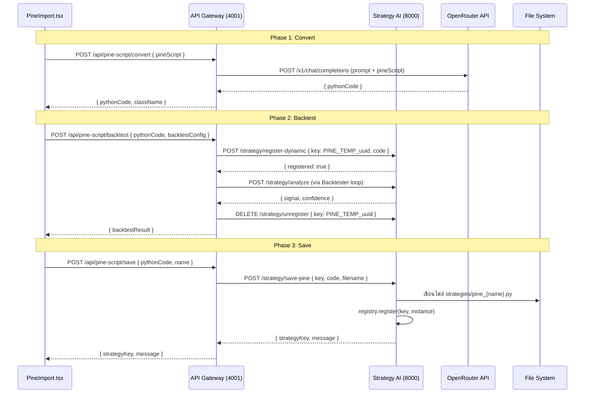

# Design Document: Pine Script Importer

## ภาพรวม (Overview)

Pine Script Importer เป็นฟีเจอร์ที่ช่วยให้ trader สามารถนำโค้ด Pine Script จาก TradingView มาแปลงเป็น Python Strategy Class ที่ extend `BaseStrategy` โดยอัตโนมัติผ่าน AI (OpenRouter) จากนั้น backtest ได้ทันที และบันทึกเป็น strategy ถาวรสำหรับใช้กับ Live Trading Bot

ฟีเจอร์นี้เชื่อมต่อ 3 layer หลักของระบบ:
- **Frontend (React/TypeScript)**: หน้า `PineImport.tsx` สำหรับ workflow ทั้งหมด
- **API Gateway (Node.js/Express)**: route `/api/pine-script/*` ทำหน้าที่ orchestrate
- **Strategy AI (Python/FastAPI)**: endpoint ใหม่สำหรับ dynamic registration และ persistence

---

## สถาปัตยกรรม (Architecture)

### Data Flow Diagram



### Component Diagram

```mermaid
graph TD
    subgraph Frontend
        PI[PineImport.tsx]
        APP[App.tsx + Sidebar]
    end

    subgraph API Gateway
        PR[pineScriptRoutes.js]
        PC[PineScriptConverter.js]
        GW_BT[Backtester.js - existing]
    end

    subgraph Strategy AI
        MAIN[main.py]
        REG[StrategyRegistry]
        DYN[/strategy/register-dynamic]
        SAVE[/strategy/save-pine]
        UNREG[/strategy/unregister]
        LOADER[pine_loader.py - auto-load]
    end

    subgraph Storage
        FS[strategies/pine_*.py]
    end

    PI --> PR
    APP --> PI
    PR --> PC
    PC --> OR[(OpenRouter API)]
    PR --> GW_BT
    GW_BT --> DYN
    DYN --> REG
    PR --> SAVE
    SAVE --> FS
    SAVE --> REG
    LOADER --> FS
    LOADER --> REG
    MAIN --> LOADER
```

---

## Components and Interfaces

### 1. Frontend: `PineImport.tsx`

หน้า React ที่จัดการ workflow ทั้งหมดใน 4 ขั้นตอน:

**State Machine:**
```
IDLE → CONVERTING → PREVIEW → BACKTESTING → RESULTS → SAVING → SAVED
                 ↘ ERROR ↙
```

**Props/State หลัก:**
```typescript
interface PineImportState {
  pineScript: string;
  pythonCode: string;
  className: string;
  backtestConfig: BacktestConfig;
  backtestResult: BacktestResult | null;
  phase: 'idle' | 'converting' | 'preview' | 'backtesting' | 'results' | 'saving' | 'saved';
  error: string | null;
  strategyName: string;
}

interface BacktestConfig {
  symbol: string;
  interval: string;
  tpPercent: number;
  slPercent: number;
  leverage: number;
  capital: number;
  startDate: string;
  endDate: string;
}
```

**Sections ใน UI:**
1. **Input Section**: textarea รับ Pine Script + validation feedback
2. **Preview Section**: code editor (read-only/editable) แสดง Python code
3. **Backtest Config Section**: form กำหนดค่า backtest
4. **Results Section**: metrics, equity curve chart, trades table
5. **Save Section**: input ชื่อ + ปุ่มบันทึก

### 2. API Gateway: `pineScriptRoutes.js`

Route handler ใหม่ที่ mount ที่ `/api/pine-script`

```javascript
// Endpoints
POST /api/pine-script/convert   → PineScriptConverter.convert()
POST /api/pine-script/backtest  → orchestrate register + backtest + unregister
POST /api/pine-script/save      → forward to strategy-ai /strategy/save-pine
GET  /api/pine-script/list      → forward to strategy-ai /strategy/list (filter PINE_)
```

### 3. API Gateway: `PineScriptConverter.js`

Module ที่รับผิดชอบการสร้าง prompt และเรียก OpenRouter

```javascript
class PineScriptConverter {
  async convert(pineScript: string): Promise<{ pythonCode: string, className: string }>
  buildPrompt(pineScript: string): string
  extractPythonCode(response: string): string
  validatePythonStructure(code: string): boolean
}
```

### 4. Strategy AI: Endpoints ใหม่

**`POST /strategy/register-dynamic`**
```python
class RegisterDynamicRequest(BaseModel):
    key: str          # PINE_TEMP_{uuid}
    python_code: str  # Python class code

# Response
{ "registered": True, "key": "PINE_TEMP_..." }
```

**`DELETE /strategy/unregister`**
```python
class UnregisterRequest(BaseModel):
    key: str

# Response
{ "unregistered": True }
```

**`POST /strategy/save-pine`**
```python
class SavePineRequest(BaseModel):
    key: str          # PINE_{UPPERCASE_NAME}
    python_code: str
    filename: str     # pine_{snake_case_name}.py

# Response
{ "strategyKey": "PINE_MY_EMA", "message": "บันทึกสำเร็จ" }
```

### 5. Strategy AI: `pine_loader.py`

Module สำหรับ auto-load strategies เมื่อ startup

```python
def load_pine_strategies(registry: StrategyRegistry, strategies_dir: str) -> list[str]:
    """
    สแกนไฟล์ pine_*.py ใน strategies_dir
    โหลดแต่ละไฟล์ด้วย importlib
    ลงทะเบียนใน registry ด้วย key PINE_{CLASSNAME}
    คืนค่ารายการ key ที่โหลดสำเร็จ
    """
```

---

## Data Models

### PineConvertRequest
```typescript
interface PineConvertRequest {
  pineScript: string;  // 10 - 50,000 ตัวอักษร
}
```

### PineConvertResponse
```typescript
interface PineConvertResponse {
  pythonCode: string;   // Python class code
  className: string;    // ชื่อ class ที่ AI สร้าง
}
```

### PineBacktestRequest
```typescript
interface PineBacktestRequest {
  pythonCode: string;
  config: {
    symbol: string;
    interval: string;
    tpPercent: number;
    slPercent: number;
    leverage: number;
    capital: number;
    startDate?: string;
    endDate?: string;
  };
}
```

### PineSaveRequest
```typescript
interface PineSaveRequest {
  pythonCode: string;
  name: string;  // ตัวอักษร ตัวเลข และ space เท่านั้น
}
```

### PineSaveResponse
```typescript
interface PineSaveResponse {
  strategyKey: string;  // PINE_{UPPERCASE_NAME}
  message: string;
}
```

### PineListResponse
```typescript
interface PineListResponse {
  strategies: Array<{
    key: string;    // PINE_{NAME}
    name: string;   // human-readable name
  }>;
}
```

---

## Prompt Engineering สำหรับ AI Conversion

### System Prompt Structure

```
You are an expert Python quant developer. Convert the given Pine Script to a Python class.

REQUIREMENTS:
1. The class MUST extend BaseStrategy
2. MUST implement compute_signal(closes, highs, lows, volumes, params) -> dict
3. MUST implement get_metadata() -> dict
4. compute_signal MUST return: {"signal": "LONG"|"SHORT"|"NONE", "stoploss": float|None, "metadata": dict}
5. Use numpy for calculations
6. Return ONLY the Python code block, no explanation

BASE CLASS INTERFACE:
{base_strategy_interface}

EXAMPLE STRATEGY:
{ema_cross_example}

PINE SCRIPT TO CONVERT:
{pine_script}
```

### การแยก Python Code จาก Response

AI response อาจมีรูปแบบหลายแบบ:
1. **Markdown code block**: ` ```python\n...\n``` `
2. **Plain code**: เริ่มต้นด้วย `import` หรือ `class`
3. **Mixed text**: มีคำอธิบายปนอยู่

Logic การแยก:
```javascript
function extractPythonCode(response) {
  // 1. ลอง extract จาก ```python ... ``` block
  const mdMatch = response.match(/```python\n([\s\S]+?)\n```/);
  if (mdMatch) return mdMatch[1].trim();
  
  // 2. ลอง extract จาก ``` ... ``` block
  const codeMatch = response.match(/```\n([\s\S]+?)\n```/);
  if (codeMatch) return codeMatch[1].trim();
  
  // 3. ใช้ทั้ง response ถ้าดูเหมือน Python code
  if (response.includes('class ') && response.includes('def ')) return response.trim();
  
  throw new Error('ไม่พบ Python code ใน response');
}
```

### การตรวจสอบโครงสร้าง Python Code

```javascript
function validatePythonStructure(code) {
  const hasBaseStrategy = /class\s+\w+\s*\(\s*BaseStrategy\s*\)/.test(code);
  const hasComputeSignal = /def\s+compute_signal\s*\(/.test(code);
  const hasGetMetadata = /def\s+get_metadata\s*\(/.test(code);
  return hasBaseStrategy && hasComputeSignal && hasGetMetadata;
}
```

---

## Temporary Strategy Registration

### กระบวนการ Register/Unregister

เมื่อผู้ใช้กด "รัน Backtest":

1. **API Gateway** สร้าง `tempKey = PINE_TEMP_${uuid()}`
2. **API Gateway** ส่ง `POST /strategy/register-dynamic` ไปยัง strategy-ai พร้อม `{ key: tempKey, python_code }`
3. **Strategy AI** ใช้ `exec()` เพื่อ compile Python code ใน isolated namespace แล้วลงทะเบียนใน registry
4. **API Gateway** รัน backtest ด้วย strategy `PYTHON:${tempKey}` ผ่าน Backtester ที่มีอยู่
5. **API Gateway** ส่ง `DELETE /strategy/unregister` เพื่อลบ temp key ออก (ทั้งกรณี success และ error)

### Dynamic Code Execution ใน Python

```python
@app.post("/strategy/register-dynamic")
async def register_dynamic(req: RegisterDynamicRequest):
    namespace = {}
    try:
        exec(req.python_code, namespace)
    except SyntaxError as e:
        raise HTTPException(400, f"Python syntax error: {e}")
    
    # หา class ที่ extend BaseStrategy
    strategy_class = None
    for name, obj in namespace.items():
        if isinstance(obj, type) and issubclass(obj, BaseStrategy) and obj is not BaseStrategy:
            strategy_class = obj
            break
    
    if not strategy_class:
        raise HTTPException(400, "ไม่พบ class ที่ extend BaseStrategy")
    
    registry.register(req.key, strategy_class())
    return {"registered": True, "key": req.key}
```

---

## Auto-Load Saved Strategies on Startup

### กระบวนการ Auto-Load

เมื่อ strategy-ai service เริ่มต้น (`main.py`):

```python
# ใน main.py หลัง registry bootstrap
from pine_loader import load_pine_strategies

loaded = load_pine_strategies(registry, "strategies/")
print(f"🌲 [PineLoader] Loaded {len(loaded)} pine strategies: {loaded}")
```

### `pine_loader.py`

```python
import os
import importlib.util
from registry import StrategyRegistry
from base_strategy import BaseStrategy

def load_pine_strategies(registry: StrategyRegistry, strategies_dir: str) -> list[str]:
    loaded_keys = []
    
    for filename in os.listdir(strategies_dir):
        if not (filename.startswith("pine_") and filename.endswith(".py")):
            continue
        
        filepath = os.path.join(strategies_dir, filename)
        module_name = filename[:-3]  # ตัด .py ออก
        
        spec = importlib.util.spec_from_file_location(module_name, filepath)
        module = importlib.util.module_from_spec(spec)
        
        try:
            spec.loader.exec_module(module)
        except Exception as e:
            print(f"⚠️ [PineLoader] Failed to load {filename}: {e}")
            continue
        
        for attr_name in dir(module):
            obj = getattr(module, attr_name)
            if (isinstance(obj, type) 
                and issubclass(obj, BaseStrategy) 
                and obj is not BaseStrategy):
                key = f"PINE_{attr_name.upper()}"
                registry.register(key, obj())
                loaded_keys.append(key)
                break
    
    return loaded_keys
```

---

## Sidebar Addition

เพิ่ม "Pine Import" ใน INTELLIGENCE section ของ `App.tsx`:

```typescript
const intelligenceItems = [
  { path: '/sentiment', name: 'Sentiment Analysis', icon: <Brain size={20} color="#a78bfa" /> },
  { path: '/pine-import', name: 'Pine Import', icon: <FileCode size={20} color="#a78bfa" /> },
];
```

เพิ่ม Route:
```typescript
import PineImport from './pages/PineImport';
// ...
<Route path="/pine-import" element={<PineImport />} />
```

---

## Correctness Properties

*A property is a characteristic or behavior that should hold true across all valid executions of a system — essentially, a formal statement about what the system should do. Properties serve as the bridge between human-readable specifications and machine-verifiable correctness guarantees.*

### Property 1: Validation rejects short input

*For any* string ที่มีความยาวน้อยกว่า 10 ตัวอักษร, PineScriptValidator SHALL คืนค่า validation error และ isValid SHALL เป็น false

**Validates: Requirements 1.2**

### Property 2: Validation rejects oversized input

*For any* string ที่มีความยาวมากกว่า 50,000 ตัวอักษร, PineScriptValidator SHALL คืนค่า validation error และ isValid SHALL เป็น false

**Validates: Requirements 1.3**

### Property 3: Validation requires Pine Script keywords

*For any* string ที่มีความยาวอยู่ในช่วง 10-50,000 ตัวอักษร แต่ไม่มี keyword `//@version`, `strategy(`, หรือ `indicator(`, PineScriptValidator SHALL คืนค่า validation error

**Validates: Requirements 1.4**

### Property 4: Convert button disabled when validation fails

*For any* input state ที่ validator คืนค่า isValid = false, ปุ่ม "แปลง" SHALL มี disabled = true

**Validates: Requirements 1.5, 3.3**

### Property 5: Prompt contains all required components

*For any* Pine Script input ที่ valid, prompt ที่ buildPrompt() สร้างขึ้น SHALL ประกอบด้วย: Pine Script code, BaseStrategy interface definition, และ example strategy code ครบทั้งสามส่วน

**Validates: Requirements 2.2**

### Property 6: Python code extraction from any response format

*For any* OpenRouter response ที่มี Python code (ทั้งในรูปแบบ markdown code block หรือ plain text), extractPythonCode() SHALL แยก Python code ออกมาได้และ code ที่ได้ต้องมี `class` และ `def` keyword

**Validates: Requirements 2.3**

### Property 7: Python structure validation

*For any* Python code string, validatePythonStructure() SHALL คืนค่า true ก็ต่อเมื่อ code มี class ที่ extend BaseStrategy, method compute_signal, และ method get_metadata ครบทั้งสามอย่าง

**Validates: Requirements 2.4**

### Property 8: Temp key format invariant

*For any* valid Python code ที่ส่งไปยัง register-dynamic endpoint, key ที่ได้ SHALL มีรูปแบบ `PINE_TEMP_` ตามด้วย UUID และ strategy SHALL ถูกลงทะเบียนใน registry ด้วย key นั้น

**Validates: Requirements 4.2**

### Property 9: Temp key cleanup after backtest

*For any* backtest ที่รันด้วย PINE_TEMP_ key (ทั้งกรณี success และ error), หลังจาก backtest เสร็จสิ้น key นั้น SHALL ไม่ปรากฏใน registry.list_keys() อีกต่อไป

**Validates: Requirements 4.6**

### Property 10: Strategy name to key transformation

*For any* strategy name ที่ประกอบด้วยตัวอักษร ตัวเลข และ space เท่านั้น, การแปลงชื่อเป็น key SHALL ได้ผลลัพธ์ที่มีรูปแบบ `PINE_` ตามด้วยชื่อที่เป็น uppercase และ space แทนด้วย underscore

**Validates: Requirements 6.2**

### Property 11: Duplicate key detection

*For any* strategy name ที่ key ที่ได้ (`PINE_{NAME}`) มีอยู่แล้วใน registry, การบันทึก SHALL คืนค่า HTTP 409 และ SHALL ไม่เขียนทับไฟล์ที่มีอยู่

**Validates: Requirements 6.5, 8.5**

### Property 12: Invalid name character rejection

*For any* strategy name ที่มีอักขระนอกจากตัวอักษร ตัวเลข และ space, validator SHALL คืนค่า error และ SHALL ไม่ดำเนินการบันทึก

**Validates: Requirements 6.6**

### Property 13: Saved strategy appears in list

*For any* strategy ที่บันทึกสำเร็จด้วย key `PINE_{NAME}`, การเรียก `GET /api/pine-script/list` SHALL คืนค่า key นั้นในรายการ

**Validates: Requirements 7.1**

### Property 14: Auto-load all pine_ files on startup

*For any* ชุดของไฟล์ `pine_*.py` ที่อยู่ใน strategies directory, หลังจาก load_pine_strategies() ทำงานเสร็จ ทุกไฟล์ที่มี class ที่ extend BaseStrategy SHALL ถูกลงทะเบียนใน registry

**Validates: Requirements 7.4**

### Property 15: Missing pineScript field returns HTTP 400

*For any* request body ที่ส่งไปยัง `POST /api/pine-script/convert` ที่ไม่มี field `pineScript`, endpoint SHALL คืนค่า HTTP 400

**Validates: Requirements 8.4**

---

## Error Handling

| Scenario | Error Source | Response |
|---|---|---|
| Pine Script สั้นเกินไป (< 10 chars) | Frontend validator | แสดง inline error, ปิดปุ่มแปลง |
| Pine Script ยาวเกินไป (> 50,000 chars) | Frontend validator | แสดง inline error, ปิดปุ่มแปลง |
| ไม่มี Pine Script keywords | Frontend validator | แสดง inline error, ปิดปุ่มแปลง |
| OpenRouter timeout (> 30s) | API Gateway | HTTP 504, "การแปลงหมดเวลา กรุณาลองใหม่" |
| OpenRouter API error | API Gateway | HTTP 502, forward error message |
| Python code ไม่มีโครงสร้าง BaseStrategy | API Gateway | HTTP 422, "ไม่สามารถแปลงได้ กรุณาตรวจสอบ Pine Script" |
| Python syntax error ใน code | Strategy AI | HTTP 400, "Python code ไม่ถูกต้อง: {detail}" |
| Strategy key ซ้ำ | Strategy AI | HTTP 409, "Strategy name already exists" |
| ชื่อ strategy มีอักขระพิเศษ | API Gateway | HTTP 400, "ชื่อ strategy ใช้ได้เฉพาะตัวอักษร ตัวเลข และ space" |
| Strategy AI service ไม่ตอบสนอง | API Gateway | HTTP 503, "Strategy AI service unavailable" |
| Backtest ไม่มี trades | Backtester | แสดงข้อความ "กลยุทธ์นี้ไม่มีสัญญาณในช่วงเวลาที่เลือก" |
| pine_*.py โหลดไม่ได้ตอน startup | pine_loader | log warning, ข้ามไฟล์นั้น ไม่ crash service |

---

## Testing Strategy

### Unit Tests

ทดสอบ logic ที่แยกออกมาได้:

- `PineScriptValidator`: ทดสอบ validation rules ทุกกรณี (length, keywords)
- `PineScriptConverter.buildPrompt()`: ตรวจสอบว่า prompt มีส่วนประกอบครบ
- `PineScriptConverter.extractPythonCode()`: ทดสอบ extraction จาก response หลายรูปแบบ
- `PineScriptConverter.validatePythonStructure()`: ทดสอบ validation ของ Python code
- `strategyNameToKey()`: ทดสอบ name → key transformation
- `pine_loader.load_pine_strategies()`: ทดสอบ auto-load logic

### Property-Based Tests

ใช้ **Hypothesis** (Python) และ **fast-check** (TypeScript) สำหรับ property tests

**Python (Hypothesis) — strategy-ai:**

```python
# Property 9: Temp key cleanup
@given(st.text(min_size=1))
@settings(max_examples=100)
def test_temp_key_cleanup_after_backtest(python_code):
    # register → backtest → unregister → ตรวจสอบว่า key หายไป
    ...

# Property 14: Auto-load all pine_ files
@given(st.lists(valid_pine_strategy_code(), min_size=1, max_size=10))
@settings(max_examples=100)
def test_autoload_all_pine_files(strategy_codes):
    # สร้างไฟล์ชั่วคราว → load → ตรวจสอบว่าทุกไฟล์ถูกโหลด
    ...
```

**TypeScript (fast-check) — frontend/api-gateway:**

```typescript
// Property 1-3: Validation rules
test('validation rejects short input', () => {
  fc.assert(fc.property(
    fc.string({ maxLength: 9 }),
    (input) => {
      const result = validatePineScript(input);
      return result.isValid === false;
    }
  ), { numRuns: 100 });
});

// Property 10: Name to key transformation
test('strategy name to key transformation', () => {
  fc.assert(fc.property(
    fc.stringMatching(/^[a-zA-Z0-9 ]+$/),
    (name) => {
      const key = strategyNameToKey(name);
      return key.startsWith('PINE_') && key === key.toUpperCase();
    }
  ), { numRuns: 100 });
});
```

### Integration Tests

- `POST /api/pine-script/convert` → mock OpenRouter → ตรวจสอบ response format
- `POST /api/pine-script/backtest` → mock strategy-ai → ตรวจสอบ register/unregister lifecycle
- `POST /api/pine-script/save` → ตรวจสอบไฟล์ถูกสร้างและ strategy ถูกลงทะเบียน
- `GET /api/pine-script/list` → ตรวจสอบ filter เฉพาะ PINE_ prefix

### Smoke Tests

- ตรวจสอบว่า endpoints ทั้งสามตอบสนอง (8.1, 8.2, 8.3)
- ตรวจสอบว่า strategy-ai startup โหลด pine strategies สำเร็จ
