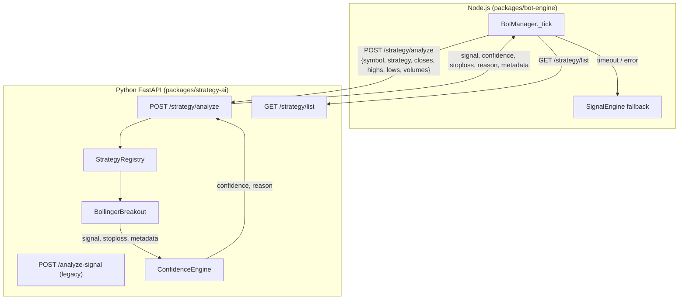

# Design Document: Python Strategy Registry

## Overview

Refactor `packages/strategy-ai/main.py` จากไฟล์เดียวที่รวม logic ทุกอย่าง ให้กลายเป็นระบบ Registry Pattern ที่ scalable โดยมีการแยก concern ชัดเจนระหว่าง strategy computation, confidence scoring, และ HTTP layer

การเปลี่ยนแปลงหลักคือ Node.js จะส่ง raw OHLCV data มาแทนที่จะส่ง signal ที่คำนวณแล้ว ทำให้ Python เป็น single source of truth สำหรับ signal generation และ risk management (stoploss)

---

## Architecture

### Component Diagram



### Data Flow

```
BotManager._tick()
  │
  ├─ fetch klines (last 100 bars)
  │
  ├─ [strategyAiMode != "off" AND bot.config.strategyName set]
  │     │
  │     └─ POST /strategy/analyze
  │           { symbol, strategy: "bb_breakout",
  │             closes[], highs[], lows[], volumes[], params? }
  │           │
  │           ├─ StrategyRegistry.get("bb_breakout")
  │           │     └─ BollingerBreakout.compute_signal(...)
  │           │           → { signal, stoploss, metadata }
  │           │
  │           └─ ConfidenceEngine.score(signal, features, regime, metadata)
  │                 → { confidence, reason }
  │
  │           Response: { signal, confidence, stoploss, reason, metadata }
  │
  ├─ [signal == "LONG" AND confidence >= threshold]
  │     └─ _openPosition(bot, signal, currPrice, closes)
  │           └─ use stoploss from Python response as initial SL
  │
  └─ [timeout / error]
        └─ fallback: computeSignal() from SignalEngine (existing)
```

---

## File / Directory Structure

```
packages/strategy-ai/
├── main.py                    # FastAPI app, endpoint wiring, registry bootstrap
├── registry.py                # StrategyRegistry class
├── base_strategy.py           # BaseStrategy abstract class
├── confidence_engine.py       # ConfidenceEngine (extracted from main.py)
├── strategies/
│   ├── __init__.py
│   └── bollinger_breakout.py  # BollingerBreakout implementation
├── schemas.py                 # Pydantic request/response models
├── requirements.txt
└── Dockerfile
```

---

## Components and Interfaces

### StrategyRegistry

Central registry ที่เก็บ strategy instances indexed by string key

```python
# registry.py
class StrategyRegistry:
    def __init__(self):
        self._strategies: dict[str, BaseStrategy] = {}

    def register(self, key: str, strategy: BaseStrategy) -> None:
        """ลงทะเบียน strategy ด้วย key"""
        self._strategies[key] = strategy

    def get(self, key: str) -> BaseStrategy:
        """คืน strategy instance หรือ raise KeyError พร้อม message"""
        if key not in self._strategies:
            available = list(self._strategies.keys())
            raise KeyError(f"Strategy '{key}' not found. Available: {available}")
        return self._strategies[key]

    def list_keys(self) -> list[str]:
        """คืน list ของ key ทั้งหมดที่ลงทะเบียนไว้"""
        return list(self._strategies.keys())
```

### BaseStrategy

Abstract base class ที่ strategy ทุกตัวต้อง inherit

```python
# base_strategy.py
from abc import ABC, abstractmethod

class BaseStrategy(ABC):
    @abstractmethod
    def compute_signal(
        self,
        closes: list[float],
        highs: list[float],
        lows: list[float],
        volumes: list[float],
        params: dict,
    ) -> dict:
        """
        Returns:
            {
                "signal": "LONG" | "SHORT" | "NONE",
                "stoploss": float | None,   # absolute price
                "metadata": dict            # strategy-specific debug info
            }
        """
        raise NotImplementedError

    @abstractmethod
    def get_metadata(self) -> dict:
        """
        Returns:
            {
                "name": str,
                "description": str,
                "version": str
            }
        """
        raise NotImplementedError
```

### BollingerBreakout Strategy

Implements TradingView "Bollinger Band Breakout With Volatility Stoploss"

**Algorithm:**

1. คำนวณ EMA(30) ของ closes เป็น basis
2. คำนวณ Standard Deviation(30) ของ closes
3. `upper_band = ema_basis + 1.0 * std`
4. `lower_band = ema_basis - 1.0 * std`
5. Signal: `close[-1] > upper_band[-1]` → `"LONG"`, otherwise `"NONE"`
6. ATR(14): `atr = mean(true_range[-14:])`
7. `stoploss = close[-1] - 1.5 * atr`

```python
# strategies/bollinger_breakout.py
import numpy as np
from base_strategy import BaseStrategy

class BollingerBreakout(BaseStrategy):
    def compute_signal(self, closes, highs, lows, volumes, params=None) -> dict:
        if len(closes) < 30:
            return {"signal": "NONE", "stoploss": None, "metadata": {}}

        arr = np.array(closes, dtype=float)
        h   = np.array(highs,  dtype=float)
        l   = np.array(lows,   dtype=float)

        # EMA-based Bollinger Bands (period=30, stddev=1x)
        ema = self._ema(arr, 30)
        std = np.std(arr[-30:])
        upper = ema + std
        lower = ema - std

        # ATR(14) stoploss
        atr = self._atr(h, l, arr, 14)
        stoploss = float(arr[-1] - 1.5 * atr)

        signal = "LONG" if arr[-1] > upper else "NONE"

        return {
            "signal": signal,
            "stoploss": stoploss if signal == "LONG" else None,
            "metadata": {
                "ema_basis": round(float(ema), 6),
                "upper_band": round(float(upper), 6),
                "lower_band": round(float(lower), 6),
                "atr": round(float(atr), 6),
                "stoploss_price": round(stoploss, 6),
            }
        }

    def get_metadata(self) -> dict:
        return {
            "name": "BollingerBreakout",
            "description": "EMA-based BB breakout (period=30, 1x SD) with ATR(14) stoploss",
            "version": "1.0.0",
        }

    def _ema(self, data: np.ndarray, period: int) -> float:
        k = 2.0 / (period + 1)
        val = data[0]
        for v in data[1:]:
            val = v * k + val * (1 - k)
        return val

    def _atr(self, highs, lows, closes, period: int) -> float:
        tr = np.maximum(
            highs[1:] - lows[1:],
            np.maximum(
                np.abs(highs[1:] - closes[:-1]),
                np.abs(lows[1:]  - closes[:-1])
            )
        )
        return float(np.mean(tr[-period:]))
```

### ConfidenceEngine

Extracted จาก `main.py` พร้อม refactor signature ให้รับ `strategy_metadata`

```python
# confidence_engine.py
class ConfidenceEngine:
    def __init__(self, mode: str, openrouter_key: str, openrouter_model: str):
        self.mode = mode
        self.openrouter_key = openrouter_key
        self.openrouter_model = openrouter_model

    def score(
        self,
        signal: str,
        features: dict,
        regime: str,
        strategy_metadata: dict,
    ) -> tuple[float, str]:
        """Returns (confidence: float, reason: str)"""
        confidence, reason = self._rule_based(signal, features, regime)

        if self.mode == "full" and 0.50 <= confidence <= 0.70:
            if self.openrouter_key:
                llm_conf, llm_reason = self._llm_analyze(signal, features, regime, strategy_metadata)
                confidence = (confidence + llm_conf) / 2
                reason = f"[ML+LLM] {llm_reason}"

        return round(max(0.0, min(1.0, confidence)), 4), reason
```

Logic ภายใน `_rule_based()` และ `_llm_analyze()` ย้ายมาจาก `main.py` โดยไม่เปลี่ยนแปลง

---

## Data Models (Pydantic Schemas)

```python
# schemas.py
from pydantic import BaseModel, field_validator

class AnalyzeRequest(BaseModel):
    symbol: str
    strategy: str                    # registry key เช่น "bb_breakout"
    closes: list[float]
    highs: list[float]
    lows: list[float]
    volumes: list[float]
    params: dict = {}

    @field_validator("closes")
    @classmethod
    def closes_min_length(cls, v):
        if len(v) < 2:
            raise ValueError("closes must have at least 2 elements")
        return v

class AnalyzeResponse(BaseModel):
    symbol: str
    signal: str                      # "LONG" | "SHORT" | "NONE"
    confidence: float
    stoploss: float | None
    reason: str
    metadata: dict
    strategy: str

class StrategyListResponse(BaseModel):
    strategies: list[str]
```

---

## New FastAPI Endpoints

### POST /strategy/analyze

```python
@app.post("/strategy/analyze", response_model=AnalyzeResponse)
async def strategy_analyze(req: AnalyzeRequest):
    # 1. Lookup strategy (raises 400 if not found)
    try:
        strategy = registry.get(req.strategy)
    except KeyError as e:
        raise HTTPException(status_code=400, detail=str(e))

    # 2. Compute signal
    result = strategy.compute_signal(
        req.closes, req.highs, req.lows, req.volumes, req.params
    )

    # 3. Feature engineering + regime (reuse existing functions)
    features = compute_features(req.closes)
    regime   = detect_regime(features)

    # 4. Confidence scoring
    confidence, reason = confidence_engine.score(
        result["signal"], features, regime, result["metadata"]
    )

    # 5. Apply threshold
    final_signal = result["signal"] if confidence >= CONFIDENCE_THRESHOLD else "NONE"

    return AnalyzeResponse(
        symbol=req.symbol,
        signal=final_signal,
        confidence=confidence,
        stoploss=result["stoploss"] if final_signal != "NONE" else None,
        reason=reason,
        metadata=result["metadata"],
        strategy=req.strategy,
    )
```

### GET /strategy/list

```python
@app.get("/strategy/list", response_model=StrategyListResponse)
async def strategy_list():
    return StrategyListResponse(strategies=registry.list_keys())
```

---

## Node.js BotManager Changes

### _strategyAiFilter() — updated routing logic

```javascript
async _strategyAiFilter(bot, signal, closes, currPrice) {
  const isOnline = await this._checkStrategyAiHealth();
  if (!isOnline) {
    return { approved: true, confidence: 1.0, reason: 'Strategy AI offline — skipped' };
  }

  const url       = this.config.strategyAiUrl || 'http://strategy-ai:8000';
  const threshold = this.config.strategyAiConfidenceThreshold ?? 0.70;
  const mode      = this.config.strategyAiMode || 'ml';
  const strategyName = bot.config.strategyName; // new field in bot config

  // Route: new endpoint if strategyName is set, legacy otherwise
  const useNewEndpoint = mode !== 'off' && strategyName;
  const endpoint = useNewEndpoint ? '/strategy/analyze' : '/analyze-signal';

  const klines = bot._lastKlines || [];  // stored during _tick
  const payload = useNewEndpoint
    ? {
        symbol:   bot.config.symbol,
        strategy: strategyName,
        closes:   klines.slice(-100).map(k => parseFloat(k[4])),
        highs:    klines.slice(-100).map(k => parseFloat(k[2])),
        lows:     klines.slice(-100).map(k => parseFloat(k[3])),
        volumes:  klines.slice(-100).map(k => parseFloat(k[5])),
      }
    : { symbol: bot.config.symbol, signal, mode, closes: closes.slice(-60) };

  try {
    const controller = new AbortController();
    const timeout = setTimeout(() => controller.abort(), 5000);
    const res = await fetch(`${url}${endpoint}`, {
      method: 'POST',
      headers: { 'Content-Type': 'application/json' },
      body: JSON.stringify(payload),
      signal: controller.signal,
    });
    clearTimeout(timeout);

    if (!res.ok) throw new Error(`Strategy AI returned ${res.status}`);
    const data = await res.json();

    const confidence = data.confidence ?? 0;
    const approved   = data.signal !== 'NONE' && confidence >= threshold;

    // Log every response (Req 6.5)
    console.log(
      `[Bot ${bot.id}] 🐍 strategy=${data.strategy ?? strategyName} ` +
      `signal=${data.signal} confidence=${(confidence * 100).toFixed(0)}% ` +
      `stoploss=${data.stoploss ?? 'N/A'}`
    );

    return {
      approved,
      confidence,
      stoploss: data.stoploss ?? null,
      reason: data.reason || `confidence=${(confidence * 100).toFixed(0)}%`,
    };
  } catch (e) {
    if (e.name === 'AbortError') {
      console.warn(`[Bot ${bot.id}] Strategy AI timeout — fallback to SignalEngine`);
    } else {
      console.warn(`[Bot ${bot.id}] Strategy AI error — fallback: ${e.message}`);
    }
    this._strategyAiOnline = false;
    return { approved: true, confidence: 1.0, reason: 'Strategy AI error — fallback' };
  }
}
```

### _openPosition() — use Python stoploss

```javascript
// After receiving aiResult from _strategyAiFilter:
if (aiResult.approved) {
  // Store Python stoploss on position for SL enforcement
  bot._pendingPythonStoploss = aiResult.stoploss;
  await this._openPosition(bot, signal, currPrice, closes);
}

// Inside _openPosition, after pushing to openPositions:
if (bot._pendingPythonStoploss) {
  const pos = bot.openPositions.at(-1);
  pos.pythonStoploss = bot._pendingPythonStoploss;
  pos.entryReason += ` | SL=${bot._pendingPythonStoploss.toFixed(4)}`;
  delete bot._pendingPythonStoploss;
}
```

### _tick() — store klines for payload

```javascript
// In _tick(), after fetching klines:
bot._lastKlines = klines;  // store for _strategyAiFilter
```

---

## Registry Bootstrap (main.py)

```python
# main.py — registry setup at startup
from registry import StrategyRegistry
from strategies.bollinger_breakout import BollingerBreakout
from confidence_engine import ConfidenceEngine

registry = StrategyRegistry()
registry.register("bb_breakout", BollingerBreakout())

confidence_engine = ConfidenceEngine(
    mode=AI_MODE,
    openrouter_key=OPENROUTER_API_KEY,
    openrouter_model=OPENROUTER_MODEL,
)
```

---

## Correctness Properties

*A property is a characteristic or behavior that should hold true across all valid executions of a system — essentially, a formal statement about what the system should do. Properties serve as the bridge between human-readable specifications and machine-verifiable correctness guarantees.*

### Property 1: Registry round-trip

*For any* unique string key and strategy instance, registering the strategy then calling `get(key)` SHALL return the exact same instance.

**Validates: Requirements 1.1, 1.3**

---

### Property 2: Registry lists all registered keys

*For any* set of unique keys registered into the registry, `list_keys()` SHALL return exactly that set of keys — no more, no fewer.

**Validates: Requirements 1.5**

---

### Property 3: Unregistered key raises descriptive error

*For any* string key that has not been registered, calling `get(key)` SHALL raise a `KeyError` whose message contains the requested key.

**Validates: Requirements 1.4**

---

### Property 4: compute_signal always returns correct shape

*For any* OHLCV arrays of length >= 30, `BollingerBreakout.compute_signal()` SHALL return a dict containing `signal` (one of "LONG", "SHORT", "NONE"), `stoploss` (float or None), and `metadata` (dict with keys `ema_basis`, `upper_band`, `lower_band`, `atr`, `stoploss_price`).

**Validates: Requirements 2.1, 3.6**

---

### Property 5: Breakout signal correctness

*For any* OHLCV series of length >= 30 where the last close price is strictly greater than the computed EMA(30) upper band (EMA + 1×SD), `BollingerBreakout.compute_signal()` SHALL return `signal = "LONG"`. For any series where the last close is within or below the upper band, it SHALL return `signal = "NONE"`.

**Validates: Requirements 3.2, 3.3**

---

### Property 6: ATR stoploss invariant

*For any* valid OHLCV series of length >= 30 that produces a LONG signal, the returned `stoploss` SHALL equal `close[-1] - 1.5 * ATR(14)` and SHALL be strictly less than `close[-1]`.

**Validates: Requirements 3.4**

---

### Property 7: ConfidenceEngine output is bounded

*For any* signal, features dict, regime string, and strategy_metadata dict, `ConfidenceEngine.score()` SHALL return a confidence value in the closed interval [0.0, 1.0] and a non-empty reason string.

**Validates: Requirements 5.2**

---

### Property 8: Low confidence suppresses signal

*For any* input to `POST /strategy/analyze` where the computed confidence is below the threshold (0.60), the response `signal` field SHALL be `"NONE"` regardless of what the strategy computed.

**Validates: Requirements 5.3**

---

### Property 9: Analyze response always has required fields

*For any* valid `POST /strategy/analyze` request (strategy exists, closes >= 2), the response SHALL contain `signal`, `confidence`, `stoploss`, `reason`, `metadata`, and `strategy` fields, with `signal` being one of `"LONG"`, `"SHORT"`, or `"NONE"`.

**Validates: Requirements 4.2**

---

### Property 10: BotManager sends last 100 bars

*For any* klines array of length N, the payload sent to `/strategy/analyze` SHALL contain `closes`, `highs`, `lows`, `volumes` arrays of length `min(N, 100)` corresponding to the most recent bars.

**Validates: Requirements 6.2**

---

## Error Handling

| Scenario | Layer | Response |
|---|---|---|
| Unknown strategy key | FastAPI | HTTP 400 `{"detail": "Strategy 'x' not found. Available: [...]"}` |
| `closes` < 2 elements | Pydantic validator | HTTP 422 validation error |
| `closes` < 30 (strategy guard) | BollingerBreakout | `signal="NONE"`, `stoploss=null` — HTTP 200 |
| Python service timeout (>5s) | BotManager | Fallback to SignalEngine, log warning |
| Python service HTTP error | BotManager | Fallback to SignalEngine, invalidate health cache |
| LLM API key missing | ConfidenceEngine | Skip LLM, use rule-based only |
| LLM call fails | ConfidenceEngine | Return rule-based confidence, log error |

---

## Testing Strategy

### Unit Tests (pytest)

- `test_registry.py` — register/get round-trip, list_keys, unknown key error
- `test_base_strategy.py` — NotImplementedError on unimplemented subclass
- `test_bollinger_breakout.py` — known price series → expected EMA/bands, ATR stoploss value, < 30 bars guard
- `test_confidence_engine.py` — output bounds, LLM skip when key missing, threshold suppression

### Property-Based Tests (Hypothesis)

Using [Hypothesis](https://hypothesis.readthedocs.io/) — minimum 100 examples per property.

Each test is tagged with a comment referencing the design property:
`# Feature: python-strategy-registry, Property N: <property_text>`

- **Property 1** — `@given(key=st.text(min_size=1), ...)` — registry round-trip
- **Property 2** — `@given(keys=st.sets(st.text(min_size=1), min_size=1))` — list_keys completeness
- **Property 3** — `@given(key=st.text(min_size=1))` — unregistered key raises KeyError
- **Property 4** — `@given(ohlcv=ohlcv_strategy(min_bars=30))` — compute_signal shape
- **Property 5** — `@given(ohlcv=ohlcv_above_upper_band())` — breakout signal correctness
- **Property 6** — `@given(ohlcv=ohlcv_strategy(min_bars=30))` — ATR stoploss < close
- **Property 7** — `@given(signal=..., features=..., regime=...)` — confidence in [0, 1]
- **Property 8** — `@given(...)` — low confidence → signal NONE (via TestClient)
- **Property 9** — `@given(req=valid_analyze_request())` — response shape via TestClient
- **Property 10** — `@given(klines=st.lists(..., min_size=1))` — payload slicing

### Integration Tests

- End-to-end: POST `/strategy/analyze` with real BollingerBreakout data
- Backward compat: POST `/analyze-signal` returns same shape as before
- GET `/strategy/list` returns `["bb_breakout"]`

---

## Extensibility: Adding a New Strategy

To add a new strategy (e.g., `RSIReversion`):

1. Create `packages/strategy-ai/strategies/rsi_reversion.py` inheriting `BaseStrategy`
2. Implement `compute_signal()` and `get_metadata()`
3. In `main.py`, add two lines:
   ```python
   from strategies.rsi_reversion import RSIReversion
   registry.register("rsi_reversion", RSIReversion())
   ```
4. The strategy is immediately available via `POST /strategy/analyze` with `"strategy": "rsi_reversion"`

No changes to endpoint code, ConfidenceEngine, or Node.js are required.

**Design rationale**: The registry pattern decouples strategy discovery from HTTP routing. The `BaseStrategy` contract ensures ConfidenceEngine can score any strategy's output without knowing its internals. The `params` dict in `compute_signal()` allows per-request parameter overrides without changing the interface.
