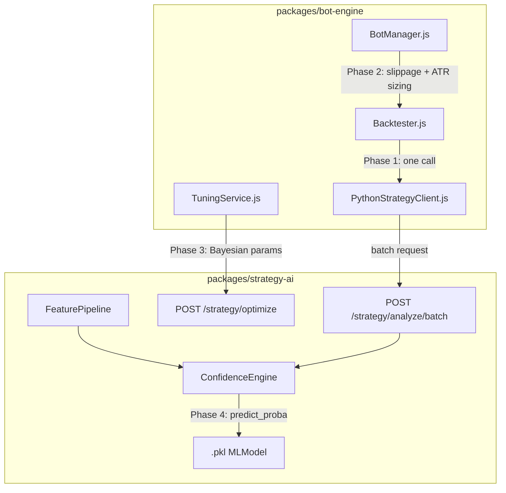

# Design Document: Quant Engine Upgrade

## Overview

This document describes the technical design for upgrading the crypto trading system from a rule-based bot to a full quantitative trading engine. The upgrade is delivered in four sequential phases, each building on the previous:

- **Phase 1** — Vectorize the Backtester: replace per-candle HTTP calls with a single batch endpoint
- **Phase 2** — Risk Management: add a slippage model and ATR-based volatility position sizing
- **Phase 3** — Bayesian Optimization: replace LLM-based tuning with Optuna + walk-forward validation
- **Phase 4** — ML-Ready Confidence Engine: load a `.pkl` model and use `predict_proba()` for scoring
- **Phase 5** — UI Cleanup: unified strategy dropdown + ATR-based TP/SL multiplier fields

The system is a Node.js/Python monorepo. `packages/bot-engine` (Node.js) handles execution logic. `packages/strategy-ai` (Python FastAPI) handles math, signals, and optimization.

---

## Architecture



**Data flow summary:**
1. `Backtester.js` calls `PythonStrategyClient.getBatchSignals()` once per backtest run
2. `BotManager._openPosition()` applies slippage and ATR-based sizing before placing orders
3. `TuningService.tuneBot()` calls `POST /strategy/optimize` (Optuna) instead of the LLM
4. `ConfidenceEngine.score()` delegates to `model.predict_proba()` when a `.pkl` is loaded

---

## Components and Interfaces

### Phase 1: Batch Endpoint + PythonStrategyClient

**New endpoint** `POST /strategy/analyze/batch` in `packages/strategy-ai/main.py`:

```python
class BatchAnalyzeRequest(BaseModel):
    symbol: str
    strategy: str
    closes: list[float]
    highs: list[float]
    lows: list[float]
    volumes: list[float]
    params: dict = {}

class BatchAnalyzeResponse(BaseModel):
    signals: list[str]       # ["LONG", "NONE", "SHORT", ...]
    confidences: list[float] # [0.72, 0.0, 0.65, ...]
```

The endpoint computes signals for all candles using vectorized pandas/numpy operations — no Python-level for-loop over candles.

**New function** in `packages/bot-engine/src/PythonStrategyClient.js`:

```js
export async function getBatchSignals(strategyKey, payload)
// payload: { closes, highs, lows, volumes, params, symbol }
// returns: { signals: string[], confidences: number[] }
```

**Backtester.js refactor** — `runBacktest()` for Python strategies:
- Before the simulation loop: call `getBatchSignals()` once, store `signals[]` and `confidences[]`
- Inside the loop: read `signals[i]` and `confidences[i]` instead of calling `getPythonSignal()`

### Phase 2: Slippage Model + VolatilityPositionSizer

**SlippageModel** — pure functions, no state, added to `packages/bot-engine/src/Backtester.js` and `BotManager.js`:

```js
// Apply 0.05% slippage to fill price
function applySlippage(price, side, action) {
  // side: 'LONG' | 'SHORT', action: 'open' | 'close'
  const factor = 0.0005;
  if (side === 'LONG'  && action === 'open')  return price * (1 + factor);
  if (side === 'SHORT' && action === 'open')  return price * (1 - factor);
  if (side === 'LONG'  && action === 'close') return price * (1 - factor);
  if (side === 'SHORT' && action === 'close') return price * (1 + factor);
}
```

**VolatilityPositionSizer** — pure function, added to `packages/bot-engine/src/Backtester.js` and `BotManager.js`:

```js
function computePositionSize(capital, highs, lows, closes, { atrPeriod = 14, riskPct = 0.01, leverage = 10 }) {
  const atr = computeATR(highs, lows, closes, atrPeriod);
  if (!atr || atr === 0) return capital * leverage; // fallback
  return (capital * riskPct) / atr;
}

function computeATR(highs, lows, closes, period = 14) {
  if (closes.length < period + 1) return 0;
  const trueRanges = [];
  for (let i = 1; i < closes.length; i++) {
    const hl = highs[i] - lows[i];
    const hc = Math.abs(highs[i] - closes[i - 1]);
    const lc = Math.abs(lows[i] - closes[i - 1]);
    trueRanges.push(Math.max(hl, hc, lc));
  }
  const recent = trueRanges.slice(-period);
  return recent.reduce((a, b) => a + b, 0) / recent.length;
}
```

### Phase 3: Bayesian Optimizer + Walk-Forward Validator

**New endpoint** `POST /strategy/optimize` in `packages/strategy-ai/main.py`:

```python
class OptimizeRequest(BaseModel):
    strategy: str
    closes: list[float]
    highs: list[float]
    lows: list[float]
    volumes: list[float]
    search_space: dict   # e.g. {"rsiOversold": [20, 50], "rsiOverbought": [50, 80]}
    n_trials: int = 50

class OptimizeResponse(BaseModel):
    best_params: dict
    best_sharpe: float
    n_trials: int
```

Uses `optuna.create_study(direction="maximize")` with the objective function computing SharpeRatio on the provided OHLCV data.

**TuningService.js refactor** — `tuneBot()`:
- Remove: `getTunedIndicatorParams()` call to `OptimizerAgent`
- Add: HTTP `POST /strategy/optimize` call via `PythonStrategyClient`
- Apply returned `best_params` to `bot.config`

**WalkForwardValidator** — new function in `packages/bot-engine/src/Backtester.js`:

```js
export async function runWalkForward(exchange, config)
// config adds: trainCandles (default: 2160 = ~3mo on 1h), testCandles (default: 720 = ~1mo on 1h)
// returns: { windows: WalkForwardWindow[], avgSharpe: number, avgPnl: number }

// WalkForwardWindow: { trainStart, trainEnd, testStart, testEnd, sharpeRatio, totalPnl, winRate }
```

Window count formula: `floor((total_candles - trainCandles) / testCandles)`

### Phase 4: ML-Ready ConfidenceEngine

**FeaturePipeline** — new class in `packages/strategy-ai/confidence_engine.py`:

```python
class FeaturePipeline:
    FEATURE_NAMES = ['rsi_14', 'ema20', 'ema50', 'ema_cross',
                     'bb_position', 'volatility_20', 'momentum_10', 'atr_14']

    def extract(self, closes: list[float], highs: list[float],
                lows: list[float]) -> np.ndarray:
        # Returns shape (8,) feature vector
```

**ConfidenceEngine refactor**:
- Constructor reads `MODEL_PATH` env var; if set, calls `joblib.load(MODEL_PATH)`
- `score()` delegates to `_ml_score()` when model is loaded, else `_rule_based()`
- `_ml_score()` calls `model.predict_proba(features)[0][1]` (positive class probability)
- On exception: log + fall back to `_rule_based()`

```python
class ConfidenceEngine:
    def __init__(self, mode, openrouter_key, openrouter_model):
        self.model = None
        model_path = os.environ.get("MODEL_PATH")
        if model_path and os.path.exists(model_path):
            try:
                import joblib
                self.model = joblib.load(model_path)
            except Exception as e:
                print(f"[ConfidenceEngine] Failed to load model: {e}")
        self.pipeline = FeaturePipeline()
        # ... existing init
```

---

## Data Models

### BatchAnalyzeRequest / BatchAnalyzeResponse (Python Pydantic)

| Field | Type | Notes |
|---|---|---|
| `symbol` | `str` | e.g. `"BTCUSDT"` |
| `strategy` | `str` | Registry key |
| `closes` | `list[float]` | Min length 50 |
| `highs` | `list[float]` | Same length as closes |
| `lows` | `list[float]` | Same length as closes |
| `volumes` | `list[float]` | Same length as closes |
| `params` | `dict` | Optional strategy params |
| → `signals` | `list[str]` | Same length as closes |
| → `confidences` | `list[float]` | Same length as closes, values in [0,1] |

### OptimizeRequest / OptimizeResponse (Python Pydantic)

| Field | Type | Notes |
|---|---|---|
| `strategy` | `str` | Registry key |
| `closes/highs/lows/volumes` | `list[float]` | OHLCV arrays |
| `search_space` | `dict` | `{param: [min, max]}` |
| `n_trials` | `int` | Default 50 |
| → `best_params` | `dict` | Optimized parameter set |
| → `best_sharpe` | `float` | Best Sharpe achieved |
| → `n_trials` | `int` | Actual trials run |

### WalkForwardWindow (JS object)

| Field | Type | Notes |
|---|---|---|
| `trainStart` | `string` | ISO 8601 |
| `trainEnd` | `string` | ISO 8601 |
| `testStart` | `string` | ISO 8601 |
| `testEnd` | `string` | ISO 8601 |
| `sharpeRatio` | `number` | |
| `totalPnl` | `number` | |
| `winRate` | `number` | Percentage |

### FeatureVector (Python numpy array)

8-element fixed-length array: `[rsi_14, ema20, ema50, ema_cross, bb_position, volatility_20, momentum_10, atr_14]`

---

## Correctness Properties

*A property is a characteristic or behavior that should hold true across all valid executions of a system — essentially, a formal statement about what the system should do. Properties serve as the bridge between human-readable specifications and machine-verifiable correctness guarantees.*

### Property 1: Batch endpoint no-look-ahead equivalence

*For any* valid OHLCV dataset of length N ≥ 50, the SignalArray returned by `POST /strategy/analyze/batch` SHALL be equivalent to calling `POST /strategy/analyze` N times with progressively longer slices of the same input.

**Validates: Requirements 1.6, 2.4**

### Property 2: Batch response length invariant

*For any* valid batch request with a `closes` array of length N, the returned `signals` and `confidences` arrays SHALL each have exactly N elements.

**Validates: Requirements 1.2**

### Property 3: Slippage always worsens fill price

*For any* valid price greater than zero, the effective fill price produced by the SlippageModel SHALL always be worse for the trader than the raw market price: LONG entry effective > raw, SHORT entry effective < raw, LONG exit effective < raw, SHORT exit effective > raw.

**Validates: Requirements 3.8**

### Property 4: Volatility-inverse position sizing

*For any* valid inputs where ATR > 0, Capital > 0, and RiskPct > 0, the computed position size SHALL be strictly positive and SHALL decrease monotonically as ATR increases.

**Validates: Requirements 4.6**

### Property 5: Walk-forward window count invariant

*For any* valid dataset where `total_candles >= trainCandles + testCandles`, the number of walk-forward windows SHALL equal `floor((total_candles - trainCandles) / testCandles)`.

**Validates: Requirements 6.4**

### Property 6: Feature pipeline shape invariant

*For any* valid OHLCV input with length ≥ 50, the FeaturePipeline SHALL always produce a feature vector of exactly 8 elements.

**Validates: Requirements 7.5**

### Property 7: ML confidence probability bounds

*For any* valid feature vector passed to a loaded MLModel, `model.predict_proba()` SHALL return a confidence value in `[0.0, 1.0]`.

**Validates: Requirements 7.6**

---

## Error Handling

| Scenario | Component | Behavior |
|---|---|---|
| Batch endpoint unavailable | `Backtester.js` | Return `{ error: 'Strategy AI service unavailable' }` immediately, no retry |
| `closes` array < 50 elements | `POST /strategy/analyze/batch` | HTTP 422 with descriptive message |
| Mismatched array lengths | `POST /strategy/analyze/batch` | HTTP 422 with descriptive message |
| ATR = 0 or insufficient candles | `VolatilityPositionSizer` | Fall back to `capital × leverage` |
| Optimization endpoint unavailable | `TuningService.js` | Log warning, retain current bot params unchanged |
| Dataset too short for walk-forward | `WalkForwardValidator` | Return `{ error: 'Insufficient data for walk-forward validation' }` |
| `MODEL_PATH` not set or file missing | `ConfidenceEngine` | Fall back to `_rule_based()` silently |
| `model.predict_proba()` raises exception | `ConfidenceEngine` | Log error, fall back to `_rule_based()` for that call |

---

## Testing Strategy

### Unit Tests (example-based)

- `applySlippage()` — verify all four direction/action combinations with concrete prices
- `computeATR()` — verify against a known hand-calculated ATR sequence
- `computePositionSize()` — verify fallback when ATR = 0
- `FeaturePipeline.extract()` — verify output shape is always 8 for valid inputs
- `ConfidenceEngine` — verify fallback to rule-based when no model loaded
- `WalkForwardValidator` — verify error returned when dataset too short

### Property-Based Tests (Hypothesis — Python, fast-check — Node.js)

Each property test runs a minimum of 100 iterations.

**Python (Hypothesis):**

- **Property 1** — Batch no-look-ahead equivalence: generate random OHLCV arrays of length 50–500, compare batch output to sequential single-call output
  - Tag: `Feature: quant-engine-upgrade, Property 1: batch no-look-ahead equivalence`
- **Property 2** — Batch response length: generate random valid requests, assert `len(signals) == len(confidences) == len(closes)`
  - Tag: `Feature: quant-engine-upgrade, Property 2: batch response length invariant`
- **Property 6** — Feature pipeline shape: generate random OHLCV arrays ≥ 50, assert `len(features) == 8`
  - Tag: `Feature: quant-engine-upgrade, Property 6: feature pipeline shape invariant`
- **Property 7** — ML confidence bounds: generate random feature vectors, assert `0.0 <= confidence <= 1.0`
  - Tag: `Feature: quant-engine-upgrade, Property 7: ML confidence probability bounds`

**Node.js (fast-check):**

- **Property 3** — Slippage invariant: generate random prices > 0, assert fill price direction for all four cases
  - Tag: `Feature: quant-engine-upgrade, Property 3: slippage always worsens fill price`
- **Property 4** — Volatility-inverse sizing: generate random ATR sequences, assert position size decreases as ATR increases
  - Tag: `Feature: quant-engine-upgrade, Property 4: volatility-inverse position sizing`
- **Property 5** — Walk-forward window count: generate random `(total, train, test)` triples where `total >= train + test`, assert window count equals `floor((total - train) / test)`
  - Tag: `Feature: quant-engine-upgrade, Property 5: walk-forward window count invariant`

### Integration Tests

- End-to-end backtest with a Python strategy: verify `runBacktest()` makes exactly one HTTP call to the batch endpoint
- `TuningService.tuneBot()`: verify it calls `POST /strategy/optimize` and does NOT call any OpenRouter endpoint
- `ConfidenceEngine` with a real `.pkl` stub: verify `predict_proba()` is called and result is clamped to `[0, 1]`

---

## Phase 5: UI Cleanup

### ATR-Based TP/SL Multipliers

Replace `tpPct` / `slPct` (fixed %) with `tpMultiplier` / `slMultiplier` (ATR multiplier) in both the engine and the UI.

**Engine changes** (Backtester.js + BotManager.js):

```js
// Dynamic TP/SL using ATR
function computeTPSL(entryPrice, side, atr, { tpMultiplier = 2.0, slMultiplier = 1.0 }) {
  if (!atr || atr === 0) return null; // fallback to legacy pct-based TP/SL
  if (side === 'LONG') return {
    tp: entryPrice + atr * tpMultiplier,
    sl: entryPrice - atr * slMultiplier,
  };
  return {
    tp: entryPrice - atr * tpMultiplier,
    sl: entryPrice + atr * slMultiplier,
  };
}
```

**UI changes** (Strategy Tester form):
- `TP%` label → `TP (ATR×)`, input accepts float (e.g. `2.0`)
- `SL%` label → `SL (ATR×)`, input accepts float (e.g. `1.0`)
- Field values are passed as `tpMultiplier` / `slMultiplier` in the backtest request payload

### Unified Strategy Selector

Remove the "Enable Python Strategy" checkbox and secondary "Strategy Name" dropdown. Merge all strategies into one dropdown.

**New backend endpoint** `GET /strategy/list` in `packages/strategy-ai/main.py`:

```python
@app.get("/strategy/list")
def list_strategies():
    return {
        "strategies": [
            {"key": "bollinger_breakout", "engine": "python"},
            {"key": "rsi_divergence",     "engine": "python"},
            # ... all registered Python strategies
        ]
    }
```

**Frontend** fetches both JS strategy keys (hardcoded or from bot-engine config) and Python strategy keys (from `GET /strategy/list`), merges them into one `<select>` with an optional engine badge.

**Backtester routing logic** (no UI toggle needed):

```js
// Backtester.js — auto-route based on strategy registry tag
const isPython = STRATEGY_REGISTRY[config.strategy]?.engine === 'python';
if (isPython) {
  const { signals, confidences } = await getBatchSignals(config.strategy, payload);
  // ... event-driven loop
} else {
  // ... existing JS strategy loop
}
```

**Error handling additions:**

| Scenario | Component | Behavior |
|---|---|---|
| ATR = 0 at TP/SL compute time | Backtester / BotManager | Fall back to legacy fixed-% TP/SL |
| `GET /strategy/list` unavailable | Frontend | Show only JS strategies, display warning |
| Unknown strategy key selected | Backtester | Return `{ error: 'Unknown strategy' }` |
