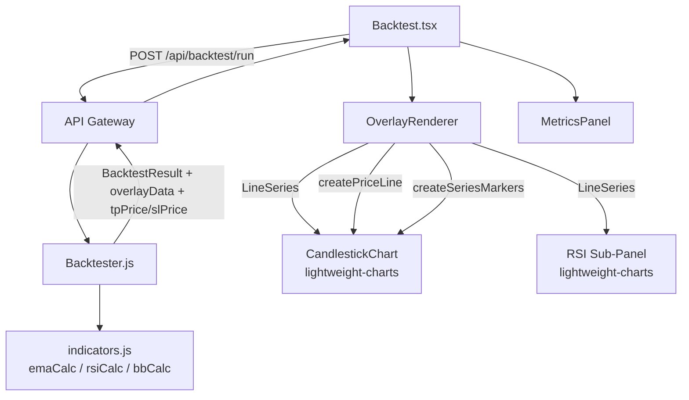

# Design Document: Strategy Chart Overlay

## Overview

Feature นี้เพิ่ม indicator overlay layer บน candlestick chart ใน Backtest view โดยแสดง EMA lines, Bollinger Bands, entry/exit signal markers พร้อม sequential labels, TP/SL horizontal price lines, metrics panel, และ RSI sub-panel แยกด้านล่าง — เหมือน TradingView

ระบบแบ่งออกเป็น 2 ส่วนหลัก:
1. **Backend**: `Backtester.js` คำนวณ `overlayData` และ `tpPrice`/`slPrice` ใน trade objects
2. **Frontend**: `OverlayRenderer` component จัดการ series lifecycle บน lightweight-charts และ `MetricsPanel` component แสดง derived metrics

---

## Architecture



**Data flow:**
1. User กด "Start Backtest" → `Backtest.tsx` ส่ง POST request
2. `Backtester.js` รัน simulation แล้วคำนวณ `overlayData` จาก closes array เดียวกัน (no look-ahead)
3. Response กลับมาพร้อม `overlayData`, trades ที่มี `tpPrice`/`slPrice`
4. `OverlayRenderer` รับ props แล้ว sync series กับ chart instance ผ่าน refs
5. `MetricsPanel` คำนวณ derived metrics จาก trades array

---

## Components and Interfaces

### Backend: `overlayData` computation (Backtester.js)

เพิ่ม function `computeOverlayData(closes, times, strategy)` ที่ return `OverlayData`:

```typescript
interface OverlayDataPoint {
  time: string;   // ISO 8601
  value: number;
}

interface OverlayData {
  ema20?:    OverlayDataPoint[];
  ema50?:    OverlayDataPoint[];
  bbUpper?:  OverlayDataPoint[];
  bbMiddle?: OverlayDataPoint[];
  bbLower?:  OverlayDataPoint[];
  rsi?:      OverlayDataPoint[];
}
```

Strategy → overlay mapping:

| Strategy | ema20 | ema50 | BB | RSI |
|---|---|---|---|---|
| EMA, EMA_CROSS, EMA_CROSS_V2 | ✓ | ✓ | | |
| BB | | | ✓ | |
| RSI, RSI_TREND | | | | ✓ |
| EMA_RSI | ✓ | ✓ | | ✓ |
| BB_RSI | | | ✓ | ✓ |
| EMA_BB_RSI | ✓ | ✓ | ✓ | ✓ |
| GRID, AI_SCOUTER, others | (empty `{}`) | | | |

### Backend: Trade object extension

```typescript
interface Trade {
  // ... existing fields ...
  tpPrice: number;
  slPrice: number;
  // multi-TP (optional)
  tp1Price?: number;
  tp2Price?: number;
  tp3Price?: number;
}
```

### Frontend: `OverlayRenderer` component

```typescript
interface OverlayRendererProps {
  chart: IChartApi | null;           // main candle chart instance
  rsiChartRef: RefObject<IChartApi>; // RSI sub-panel chart instance
  overlayData: OverlayData;
  trades: Trade[];
  strategy: string;
  showOverlay: boolean;
  showMarkers: boolean;
  toggleStates: OverlayToggleState;
  onToggleChange: (key: keyof OverlayToggleState, value: boolean) => void;
}

interface OverlayToggleState {
  ema20: boolean;
  ema50: boolean;
  bb: boolean;
  rsi: boolean;
}
```

`OverlayRenderer` เป็น non-rendering component (returns null) ที่ใช้ `useEffect` จัดการ series lifecycle:
- เก็บ series refs ใน `useRef` map
- cleanup series เก่าก่อน render ใหม่ทุกครั้งที่ `overlayData` หรือ `strategy` เปลี่ยน
- ใช้ `chart.addSeries(LineSeries, options)` สำหรับ indicator lines
- ใช้ `candleSeries.createPriceLine(options)` สำหรับ TP/SL horizontal lines

### Frontend: `MetricsPanel` component

```typescript
interface MetricsPanelProps {
  trades: Trade[];
  avgWin: number;
  avgLoss: number;
}
```

Pure computation functions (ใน `backtestUtils.ts`):
- `computeWinStreak(trades: Trade[]): number`
- `computeAvgR(avgWin: number, avgLoss: number): number`
- `formatWL(trades: Trade[]): string`
- `formatWinRate(winRate: number): string`

### Frontend: RSI Sub-Panel

เพิ่ม `rsiChartContainerRef` ใน `Backtest.tsx` สำหรับ RSI chart instance แยก:
- แสดงเฉพาะเมื่อ `overlayData.rsi` มีข้อมูล
- sync time scale กับ candle chart ผ่าน `subscribeVisibleTimeRangeChange` (pattern เดิมที่มีอยู่แล้ว)
- มี reference lines ที่ 70 (overbought) และ 30 (oversold)

---

## Data Models

### `BacktestResult` (extended)

```typescript
interface BacktestResult {
  // ... existing fields ...
  overlayData: OverlayData;  // เพิ่มใหม่
  trades: Trade[];           // Trade มี tpPrice/slPrice แล้ว
}
```

### Overlay series color constants

```typescript
const OVERLAY_COLORS = {
  ema20:    '#0ecb81',  // green
  ema50:    '#f6a609',  // orange
  bbUpper:  '#2196f3',  // blue dashed
  bbMiddle: '#2196f3',  // blue solid
  bbLower:  '#2196f3',  // blue dashed
  rsi:      '#9c27b0',  // purple
  tp:       '#0ecb81',  // green
  sl:       '#f6465d',  // red
} as const;
```

### Marker label format

Entry markers: `"BUY {n}"` / `"SELL {n}"` โดย `n` คือ sequential index (1-based) ของ trade ใน array
Exit markers: `trade.exitReason` (`"TP"`, `"SL"`, `"Signal Flipped"`)

---

## Correctness Properties

*A property is a characteristic or behavior that should hold true across all valid executions of a system — essentially, a formal statement about what the system should do. Properties serve as the bridge between human-readable specifications and machine-verifiable correctness guarantees.*

### Property 1: overlayData always present in backtest result

*For any* valid backtest config and kline dataset, the backtest result SHALL always contain an `overlayData` field (either a populated object or an empty object `{}`), never `undefined` or `null`.

**Validates: Requirements 1.1, 1.7, 1.8**

---

### Property 2: Strategy-to-overlay mapping correctness

*For any* backtest run with strategy in `{EMA, EMA_CROSS, BB, BB_RSI, RSI, EMA_RSI, EMA_BB_RSI}` and sufficient kline data (≥ 50 candles), the `overlayData` SHALL contain exactly the indicator arrays specified by the strategy mapping table, and each array SHALL be non-empty with elements of shape `{ time: string, value: number }`.

**Validates: Requirements 1.3, 1.4, 1.5, 1.6**

---

### Property 3: TP/SL price formula correctness

*For any* trade with `entryPrice > 0`, `tpPercent > 0`, `slPercent > 0`:
- LONG trade: `tpPrice === entryPrice * (1 + tpPercent/100)` and `slPrice === entryPrice * (1 - slPercent/100)`
- SHORT trade: `tpPrice === entryPrice * (1 - tpPercent/100)` and `slPrice === entryPrice * (1 + slPercent/100)`

**Validates: Requirements 2.1, 2.2, 2.3**

---

### Property 4: All trades have tpPrice and slPrice

*For any* backtest result that contains at least one trade, every trade object SHALL have `tpPrice` and `slPrice` as finite numbers greater than zero.

**Validates: Requirements 2.1**

---

### Property 5: Overlay time offset correctness

*For any* `OverlayDataPoint` with ISO 8601 time string `t`, the rendered lightweight-charts time value SHALL equal `Math.floor(new Date(t).getTime() / 1000) + 7 * 3600` — matching the same UTC+7 offset applied to candlestick data.

**Validates: Requirements 3.5**

---

### Property 6: Entry marker label format

*For any* array of trades, `buildMarkersFromTrades` SHALL produce entry markers where the nth LONG trade (1-indexed) has text `"BUY {n}"` and the nth SHORT trade has text `"SELL {n}"`, with BUY markers having `position: 'belowBar'` and color `#0ecb81`, and SELL markers having `position: 'aboveBar'` and color `#f6465d`.

**Validates: Requirements 4.1, 4.2**

---

### Property 7: Exit marker label matches exit reason

*For any* trade, the exit marker produced by `buildMarkersFromTrades` SHALL have `text` equal to `trade.exitReason`.

**Validates: Requirements 4.3**

---

### Property 8: TP/SL line label format

*For any* trade with `tpPrice` and `slPrice`, the formatted TP line label SHALL be `"TP / {tpPrice.toFixed(2)}"` and the SL line label SHALL be `"SL / {slPrice.toFixed(2)}"`.

**Validates: Requirements 5.1, 5.2**

---

### Property 9: Metrics computation correctness

*For any* non-empty trades array:
- `computeWinStreak(trades)` SHALL return the count of consecutive winning trades (pnl > 0) counting backwards from the last trade
- `computeAvgR(avgWin, avgLoss)` SHALL return `Math.abs(avgWin / avgLoss)` when `avgLoss !== 0`
- `formatWL(trades)` SHALL return `"{winCount} / {lossCount}"` where winCount = trades with pnl > 0

**Validates: Requirements 6.2, 6.3, 6.4**

---

## Error Handling

| Scenario | Behavior |
|---|---|
| Indicator computation throws | `computeOverlayData` catches error, returns `{}`, backtest continues |
| `overlayData` is `{}` | `OverlayRenderer` renders nothing, no error thrown |
| `trades` array is empty | `MetricsPanel` displays `"--"` for all metrics |
| RSI data absent | RSI sub-panel hidden (`display: none`) |
| Chart ref is null | `OverlayRenderer` effects bail out early with guard clause |
| `avgLoss === 0` in Avg R | `computeAvgR` returns `0` (avoid division by zero) |
| Multi-TP not configured | `tp1Price`/`tp2Price`/`tp3Price` fields omitted from trade object |

---

## Testing Strategy

### Unit Tests (example-based)

ทดสอบ pure functions ใน `backtestUtils.ts` และ `computeOverlayData`:

- `computeOverlayData` returns correct keys per strategy
- `computeOverlayData` returns `{}` for GRID/AI_SCOUTER
- `computeOverlayData` returns `{}` on error without throwing
- `buildMarkersFromTrades` produces correct marker count (2 per trade)
- `MetricsPanel` displays `"--"` when trades is empty
- TP/SL line labels match format spec
- Toggle off → series hidden; toggle on → series visible
- RSI panel hidden when `overlayData.rsi` absent

### Property-Based Tests

ใช้ **fast-check** (JavaScript PBT library) รัน minimum 100 iterations ต่อ property

```
Feature: strategy-chart-overlay, Property 1: overlayData always present
Feature: strategy-chart-overlay, Property 2: strategy-to-overlay mapping
Feature: strategy-chart-overlay, Property 3: TP/SL price formula
Feature: strategy-chart-overlay, Property 4: all trades have tpPrice/slPrice
Feature: strategy-chart-overlay, Property 5: overlay time offset
Feature: strategy-chart-overlay, Property 6: entry marker label format
Feature: strategy-chart-overlay, Property 7: exit marker label matches exit reason
Feature: strategy-chart-overlay, Property 8: TP/SL line label format
Feature: strategy-chart-overlay, Property 9: metrics computation
```

**Generators ที่ต้องสร้าง:**
- `arbTrade()` — arbitrary Trade object with valid entryPrice, exitPrice, pnl, exitReason
- `arbTradeArray()` — array of 1–50 arbitrary trades
- `arbOverlayDataPoint()` — arbitrary `{ time: ISO string, value: positive number }`
- `arbBacktestConfig()` — arbitrary config with strategy from known list

### Integration Tests

- POST `/api/backtest/run` กับ EMA strategy → response มี `overlayData.ema20` และ `overlayData.ema50`
- POST `/api/backtest/run` กับ GRID strategy → response มี `overlayData: {}`
- Trade objects ใน response มี `tpPrice` และ `slPrice`
- RSI sub-panel time scale sync กับ candle chart (visual/E2E)
