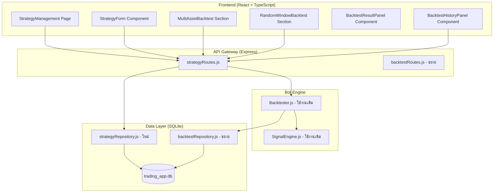

# เอกสารออกแบบ (Design Document)
## Strategy Management พร้อม Backtest

---

## ภาพรวม (Overview)

ระบบ Strategy Management พร้อม Backtest เป็น feature ใหม่ที่ต่อยอดจากโครงสร้างที่มีอยู่ใน codebase โดยเพิ่มชั้น **Strategy Definition Management** ที่ให้ผู้ใช้สามารถ CRUD กลยุทธ์การเทรดได้ พร้อมระบบ **Multi-Asset Backtest** และ **Random Window Backtest** เพื่อทดสอบความทนทานของกลยุทธ์ในสภาวะตลาดที่หลากหลาย

ระบบนี้ประกอบด้วย 3 ส่วนหลัก:
1. **Backend**: Strategy CRUD API + Backtest orchestration ใน `packages/api-gateway`
2. **Data Layer**: ตาราง `strategy_definitions` และ `strategy_backtest_results` ใน SQLite
3. **Frontend**: หน้า React ใหม่ `/strategy-management` ใน `src/pages/StrategyManagement`

ระบบนี้ **ไม่แทนที่** `Backtester.js` ที่มีอยู่ แต่ใช้เป็น execution engine โดยตรง และ **ไม่แทนที่** หน้า `/backtest` ที่มีอยู่ แต่เพิ่มความสามารถใหม่ผ่าน tab ใหม่ใน sidebar

---

## สถาปัตยกรรม (Architecture)



### การไหลของข้อมูล (Data Flow)

**Multi-Asset Backtest:**
```
Frontend → POST /api/strategies/:id/backtest/multi-asset
  → strategyRoutes.js (validate + load strategy)
  → Promise.allSettled([runBacktest(symbol1), runBacktest(symbol2), ...])
  → Backtester.js (existing engine)
  → saveStrategyBacktestResult() → DB
  → ส่งคืน { results, summary, executionTimeMs }
```

**Random Window Backtest:**
```
Frontend → POST /api/strategies/:id/backtest/random-window
  → strategyRoutes.js (validate + generate windows)
  → generateNonOverlappingWindows(lookbackYears, windowDays, numWindows)
  → Promise.allSettled([runBacktest(symbol, window1), ...])
  → Backtester.js (existing engine)
  → saveStrategyBacktestResult() → DB
  → ส่งคืน { windows, summary, executionTimeMs }
```

---

## Components และ Interfaces

### Backend Components

#### `packages/api-gateway/src/routes/strategyRoutes.js` (ใหม่)

```javascript
// Routes ที่ expose:
GET    /api/strategies                              // list all strategies
GET    /api/strategies/:id                          // get strategy by id
POST   /api/strategies                              // create strategy
PUT    /api/strategies/:id                          // update strategy
DELETE /api/strategies/:id                          // delete strategy
POST   /api/strategies/:id/backtest/multi-asset     // run multi-asset backtest
POST   /api/strategies/:id/backtest/random-window   // run random window backtest
GET    /api/strategies/:id/backtest/history         // list backtest history
GET    /api/strategies/:id/backtest/history/:btId   // get full backtest detail
```

#### `packages/data-layer/src/repositories/strategyRepository.js` (ใหม่)

```javascript
// Functions:
createStrategy(definition)           // INSERT strategy_definitions
getStrategyById(id)                  // SELECT by id
getAllStrategies(filter?)            // SELECT all, optional filter by engineType/tags
updateStrategy(id, partial)          // UPDATE partial fields + updatedAt
deleteStrategy(id)                   // DELETE by id
strategyNameExists(name, excludeId?) // CHECK duplicate name
saveStrategyBacktestResult(result)   // INSERT strategy_backtest_results
getStrategyBacktestHistory(strategyId, limit) // SELECT history
getStrategyBacktestById(btId)        // SELECT full detail
```

#### `packages/api-gateway/src/services/multiAssetBacktestService.js` (ใหม่)

```javascript
// Functions:
runMultiAssetBacktest(exchange, strategyDef, config)
  // → Promise.allSettled() ของ runBacktest() แต่ละ symbol
  // → คำนวณ summary metrics
  // → return { results, summary, executionTimeMs }

runRandomWindowBacktest(exchange, strategyDef, config)
  // → generateNonOverlappingWindows()
  // → Promise.allSettled() ของ runBacktest() แต่ละ (symbol, window)
  // → คำนวณ consistency score
  // → return { windows, summary, executionTimeMs }

generateNonOverlappingWindows(lookbackYears, windowDays, numWindows)
  // → สุ่ม startDate ที่ไม่ overlap กัน
  // → return [{ startDate, endDate }]
```

### Frontend Components

#### `src/pages/StrategyManagement/index.tsx` (ใหม่)

หน้าหลักที่ประกอบด้วย tabs:
- **Strategies** — รายการ strategy cards + CRUD
- **Multi-Asset Backtest** — form + results
- **Random Window Backtest** — form + results

#### `src/pages/StrategyManagement/StrategyForm.tsx` (ใหม่)

Modal/panel สำหรับสร้าง/แก้ไข strategy:
- `name` (text input)
- `description` (textarea)
- `engineType` (dropdown: js / python)
- `defaultParams` (JSON textarea)
- `tags` (tag input)

#### `src/pages/StrategyManagement/BacktestResultPanel.tsx` (ใหม่)

แสดงผลลัพธ์ backtest:
- SummaryCards (totalPnl, winRate, sharpeRatio, maxDrawdown, totalTrades)
- AssetResultTable (sortable columns)
- EquityChart (lightweight-charts)
- WindowResultTable (สำหรับ random window)

#### `src/pages/StrategyManagement/BacktestHistoryPanel.tsx` (ใหม่)

แสดงประวัติ backtest ของ strategy:
- List ของ backtest runs
- คลิกเพื่อดู full detail

---

## Data Models

### ตาราง `strategy_definitions` (ใหม่)

```sql
CREATE TABLE IF NOT EXISTS strategy_definitions (
  id           TEXT PRIMARY KEY,          -- UUID v4
  name         TEXT NOT NULL UNIQUE,      -- ชื่อกลยุทธ์ (unique)
  description  TEXT NOT NULL DEFAULT '',  -- markdown text
  engineType   TEXT NOT NULL,             -- 'js' | 'python'
  defaultParams TEXT NOT NULL DEFAULT '{}', -- JSON object
  tags         TEXT NOT NULL DEFAULT '[]',  -- JSON array of strings
  createdAt    TEXT NOT NULL,             -- ISO 8601
  updatedAt    TEXT NOT NULL              -- ISO 8601
);
CREATE INDEX IF NOT EXISTS idx_strategy_definitions_engineType ON strategy_definitions(engineType);
CREATE INDEX IF NOT EXISTS idx_strategy_definitions_updatedAt ON strategy_definitions(updatedAt DESC);
```

### ตาราง `strategy_backtest_results` (ใหม่)

```sql
CREATE TABLE IF NOT EXISTS strategy_backtest_results (
  backtestId     TEXT PRIMARY KEY,         -- UUID v4
  strategyId     TEXT NOT NULL,            -- FK → strategy_definitions.id
  backtestType   TEXT NOT NULL,            -- 'multi-asset' | 'random-window'
  symbols        TEXT NOT NULL,            -- JSON array of strings
  interval       TEXT NOT NULL,            -- '1m' | '5m' | '15m' | '1h' | '4h' | '1d'
  config         TEXT NOT NULL,            -- JSON (params ที่ใช้รัน)
  summaryMetrics TEXT NOT NULL,            -- JSON (summary object)
  assetResults   TEXT NOT NULL,            -- JSON array (AssetResult[])
  createdAt      TEXT NOT NULL             -- ISO 8601
);
CREATE INDEX IF NOT EXISTS idx_strategy_bt_results_strategyId ON strategy_backtest_results(strategyId, createdAt DESC);
```

### TypeScript Interfaces

```typescript
interface StrategyDefinition {
  id: string;                    // UUID v4
  name: string;
  description: string;           // markdown
  engineType: 'js' | 'python';
  defaultParams: Record<string, unknown>;
  tags: string[];
  createdAt: string;             // ISO 8601
  updatedAt: string;             // ISO 8601
}

interface AssetResult {
  symbol: string;
  rank: number;
  totalPnl: number;
  winRate: number;
  sharpeRatio: number;
  maxDrawdown: number;
  totalTrades: number;
  equityCurve: { time: string; value: number }[];
  error?: string;                // ถ้า backtest ล้มเหลว
}

interface MultiAssetBacktestResult {
  backtestId: string;
  strategyId: string;
  strategyName: string;
  results: AssetResult[];
  summary: {
    bestSymbol: string;
    worstSymbol: string;
    avgWinRate: number;
    avgSharpeRatio: number;
    avgTotalPnl: number;
    totalSymbolsTested: number;
    successfulSymbols: number;
    failedSymbols: number;
  };
  executionTimeMs: number;
}

interface WindowResult {
  windowStart: string;           // ISO 8601
  windowEnd: string;             // ISO 8601
  totalPnl: number;
  winRate: number;
  sharpeRatio: number;
  maxDrawdown: number;
}

interface RandomWindowBacktestResult {
  backtestId: string;
  strategyId: string;
  strategyName: string;
  windows: WindowResult[];
  summary: {
    consistencyScore: number;    // 0.0 - 1.0
    avgWinRate: number;
    avgSharpeRatio: number;
    avgTotalPnl: number;
    bestWindow: WindowResult;
    worstWindow: WindowResult;
  };
  executionTimeMs: number;
}
```

---

## Correctness Properties

*A property is a characteristic or behavior that should hold true across all valid executions of a system — essentially, a formal statement about what the system should do. Properties serve as the bridge between human-readable specifications and machine-verifiable correctness guarantees.*

### Property 1: Strategy Definition Round-Trip

*For any* valid StrategyDefinition ที่ถูกสร้างและบันทึกลง database, การดึงข้อมูลกลับมาด้วย id เดิมต้องได้ object ที่มีทุกฟิลด์ครบถ้วนและมีค่าเหมือนกันทุกประการ

**Validates: Requirements 1.1, 2.1**

---

### Property 2: Duplicate Name Rejection

*For any* strategy name ที่มีอยู่ใน database แล้ว, การพยายามสร้าง strategy ใหม่ด้วย name เดิมต้องถูก reject เสมอ ไม่ว่า description, engineType, หรือ defaultParams จะเป็นอะไรก็ตาม

**Validates: Requirements 1.2**

---

### Property 3: Partial Update Preserves Unchanged Fields

*For any* StrategyDefinition ที่มีอยู่ใน database, การ update เฉพาะ subset ของ fields ต้องไม่เปลี่ยนแปลง fields ที่ไม่ได้ส่งมา และ `updatedAt` ต้องมีค่าใหม่ที่มากกว่าหรือเท่ากับค่าเดิมเสมอ

**Validates: Requirements 1.4**

---

### Property 4: Strategy List Ordering

*For any* collection ของ StrategyDefinitions ที่มีใน database, การดึงรายการทั้งหมดต้องได้ผลลัพธ์ที่เรียงตาม `updatedAt` descending เสมอ (item ที่ updatedAt ล่าสุดอยู่อันดับแรก)

**Validates: Requirements 1.7**

---

### Property 5: Filter Returns Only Matching Strategies

*For any* filter condition (engineType หรือ tag), ผลลัพธ์ที่ได้จากการกรองต้องมีเฉพาะ strategies ที่ตรงกับ filter condition นั้นเท่านั้น — ไม่มี strategy ที่ไม่ตรงกับ filter ปรากฏในผลลัพธ์

**Validates: Requirements 1.8**

---

### Property 6: Non-Existent Strategy Returns 404

*For any* UUID ที่ไม่มีอยู่ใน strategy_definitions table, การ GET strategy ด้วย id นั้นต้องได้ HTTP 404 เสมอ

**Validates: Requirements 2.5**

---

### Property 7: Multi-Asset Results Cover All Symbols

*For any* list ของ symbols ที่ส่งเข้า Multi-Asset Backtest, ผลลัพธ์ที่ได้ต้องมี AssetResult สำหรับทุก symbol ใน input list (ไม่ว่าจะสำเร็จหรือมี error) และจำนวน results ต้องเท่ากับจำนวน symbols ที่ส่งเข้ามา

**Validates: Requirements 3.1, 3.5**

---

### Property 8: Multi-Asset Results Sorted by PnL

*For any* Multi-Asset Backtest result ที่มี AssetResults หลายตัว, ผลลัพธ์ที่สำเร็จ (ไม่มี error) ต้องเรียงตาม `totalPnl` descending เสมอ และ `rank` ต้องสอดคล้องกับลำดับนั้น

**Validates: Requirements 3.4, 3.6**

---

### Property 9: Summary Metrics Consistency

*For any* Multi-Asset Backtest result, `summary.avgWinRate` ต้องเท่ากับค่าเฉลี่ยของ `winRate` ของ AssetResults ที่สำเร็จทุกตัว, `summary.bestSymbol` ต้องเป็น symbol ที่มี `totalPnl` สูงสุด, และ `summary.worstSymbol` ต้องเป็น symbol ที่มี `totalPnl` ต่ำสุด

**Validates: Requirements 3.7, 8.1**

---

### Property 10: Random Windows Are Non-Overlapping

*For any* set ของ random windows ที่ถูก generate, ทุก pair ของ windows ต้องไม่ overlap กัน — กล่าวคือ สำหรับทุก pair (i, j) ที่ i ≠ j ต้องมี `windows[i].endDate <= windows[j].startDate` หรือ `windows[j].endDate <= windows[i].startDate`

**Validates: Requirements 4.5**

---

### Property 11: Consistency Score Matches Window Results

*For any* Random Window Backtest result, `summary.consistencyScore` ต้องเท่ากับ `count(windows ที่มี totalPnl > 0) / windows.length` เสมอ

**Validates: Requirements 4.7**

---

### Property 12: Backtest Determinism

*For any* backtest configuration (strategy, symbol, interval, startDate, endDate, params), การรัน backtest สองครั้งด้วย config เดียวกันต้องได้ `totalPnl`, `winRate`, `totalTrades`, และ `sharpeRatio` ที่เหมือนกันทุกครั้ง

**Validates: Requirements 7.7**

---

### Property 13: Fee Deduction Correctness

*For any* trade ที่เกิดขึ้นใน backtest, `pnl` ที่บันทึกต้องถูกหักค่าธรรมเนียม `2 × positionSize × 0.0004` เสมอ (entry fee + exit fee)

**Validates: Requirements 7.4**

---

## Error Handling

### Backend Error Handling

| สถานการณ์ | HTTP Status | Error Message |
|-----------|-------------|---------------|
| `name` ซ้ำ | 409 Conflict | "ชื่อกลยุทธ์นี้มีอยู่แล้วในระบบ" |
| Strategy id ไม่พบ | 404 Not Found | "ไม่พบกลยุทธ์ที่ระบุ" |
| ลบ strategy ที่มี active bot | 409 Conflict | "ไม่สามารถลบกลยุทธ์ที่มี bot กำลังใช้งานอยู่" |
| `symbols` เกิน 20 | 400 Bad Request | "รองรับสูงสุด 20 coin ต่อการรัน backtest" |
| `numWindows` เกิน 10 | 400 Bad Request | "รองรับสูงสุด 10 windows ต่อการรัน" |
| Required fields ขาด | 400 Bad Request | "Missing required fields: {fieldName}" |
| Exchange ไม่พร้อม | 503 Service Unavailable | "Exchange not available" |
| Backtest id ไม่พบ | 404 Not Found | "ไม่พบผลลัพธ์ backtest ที่ระบุ" |

### Partial Failure Handling

เมื่อ backtest ของ coin ใด coin หนึ่งล้มเหลวใน Multi-Asset Backtest:
- บันทึก error ใน `AssetResult.error` ของ coin นั้น
- ดำเนินการ coin ที่เหลือต่อไป (ไม่หยุดทั้ง batch)
- นับ coin ที่ล้มเหลวใน `summary.failedSymbols`
- ส่งคืน HTTP 200 พร้อม partial results (ไม่ใช่ 500)

### Frontend Error Handling

- แสดง error message ที่อ่านเข้าใจได้ใน UI (ไม่ให้หน้าพัง)
- Restore ปุ่ม submit หลังจาก error
- แสดง inline validation errors ก่อน submit
- Loading indicators ระหว่างรอ API

---

## Testing Strategy

### Unit Tests (Example-Based)

**strategyRepository.test.js**
- สร้าง strategy ใหม่ได้สำเร็จ
- ส่งคืน error เมื่อ name ซ้ำ
- ส่งคืน error เมื่อลบ strategy ที่มี active bot
- ส่งคืน 404 เมื่อ id ไม่พบ

**multiAssetBacktestService.test.js**
- `generateNonOverlappingWindows` ส่งคืน windows จำนวนที่ขอ
- `generateNonOverlappingWindows` ส่งคืน windows ที่ endDate ไม่เกินวันปัจจุบัน
- Summary metrics คำนวณถูกต้องเมื่อ coin บางตัวล้มเหลว

**strategyRoutes.test.js**
- Validation: ส่งคืน 400 เมื่อ required fields ขาด
- Validation: ส่งคืน 400 เมื่อ symbols เกิน 20
- Validation: ส่งคืน 400 เมื่อ numWindows เกิน 10

### Property-Based Tests

ใช้ **fast-check** (JavaScript) สำหรับ property-based testing โดยรัน minimum **100 iterations** ต่อ property

**strategyRepository.property.test.js**

```javascript
// Property 1: Strategy Definition Round-Trip
// Feature: strategy-management-backtest, Property 1: Strategy Definition Round-Trip
fc.assert(fc.asyncProperty(
  fc.record({ name: fc.string(), description: fc.string(), engineType: fc.constantFrom('js', 'python'), ... }),
  async (def) => {
    const created = await createStrategy(def);
    const loaded = await getStrategyById(created.id);
    return deepEqual(created, loaded);
  }
), { numRuns: 100 });

// Property 2: Duplicate Name Rejection
// Feature: strategy-management-backtest, Property 2: Duplicate Name Rejection
fc.assert(fc.asyncProperty(
  fc.string({ minLength: 1 }),
  async (name) => {
    await createStrategy({ name, engineType: 'js', ... });
    const result = await createStrategy({ name, engineType: 'python', ... });
    return result.error !== undefined;
  }
), { numRuns: 100 });

// Property 3: Partial Update Preserves Unchanged Fields
// Feature: strategy-management-backtest, Property 3: Partial Update Preserves Unchanged Fields
// Property 4: Strategy List Ordering
// Feature: strategy-management-backtest, Property 4: Strategy List Ordering
// Property 5: Filter Returns Only Matching Strategies
// Feature: strategy-management-backtest, Property 5: Filter Returns Only Matching Strategies
// Property 6: Non-Existent Strategy Returns 404
// Feature: strategy-management-backtest, Property 6: Non-Existent Strategy Returns 404
```

**multiAssetBacktestService.property.test.js**

```javascript
// Property 7: Multi-Asset Results Cover All Symbols
// Feature: strategy-management-backtest, Property 7: Multi-Asset Results Cover All Symbols

// Property 8: Multi-Asset Results Sorted by PnL
// Feature: strategy-management-backtest, Property 8: Multi-Asset Results Sorted by PnL

// Property 9: Summary Metrics Consistency
// Feature: strategy-management-backtest, Property 9: Summary Metrics Consistency

// Property 10: Random Windows Are Non-Overlapping
// Feature: strategy-management-backtest, Property 10: Random Windows Are Non-Overlapping

// Property 11: Consistency Score Matches Window Results
// Feature: strategy-management-backtest, Property 11: Consistency Score Matches Window Results
```

**backtester.property.test.js** (ขยายจากที่มีอยู่)

```javascript
// Property 12: Backtest Determinism
// Feature: strategy-management-backtest, Property 12: Backtest Determinism

// Property 13: Fee Deduction Correctness
// Feature: strategy-management-backtest, Property 13: Fee Deduction Correctness
```

### Integration Tests

- `POST /api/strategies` → สร้าง strategy จริงใน test DB
- `POST /api/strategies/:id/backtest/multi-asset` → รัน backtest จริงกับ mock exchange
- `GET /api/strategies/:id/backtest/history` → ดึงประวัติจาก DB

### Frontend Tests (Snapshot + Example)

- StrategyForm render ถูกต้องสำหรับ create mode และ edit mode
- BacktestResultPanel แสดง SummaryCards ครบทุก metric
- BacktestHistoryPanel แสดง "ยังไม่มีประวัติ" เมื่อ list ว่าง
- Sidebar แสดง "Strategy Management" link ใน CRYPTO section
